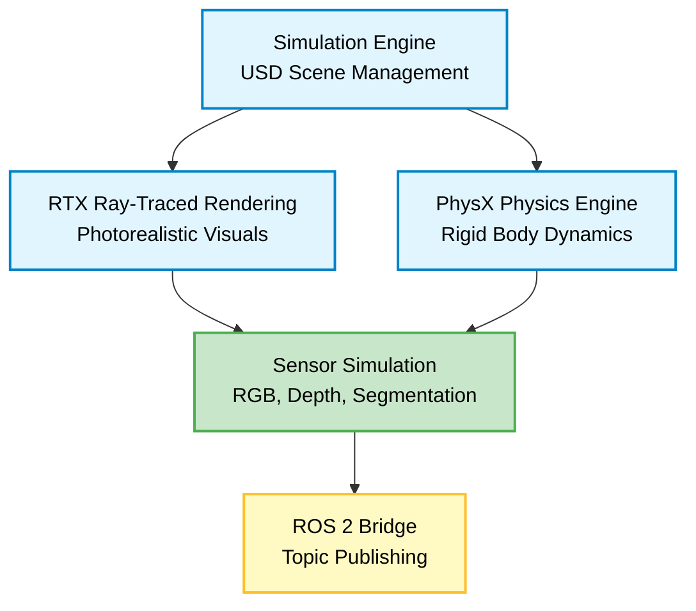

# Chapter 1: Isaac Sim Synthetic Data Generation

:::tip Learning Objectives
After completing this chapter (estimated 25 minutes), you should be able to:
- **Explain** the Isaac Sim architecture and its key components (simulation engine, rendering, sensor simulation, ROS 2 bridge)
- **Identify** three or more domain randomization techniques (lighting variation, texture swapping, procedural object placement)
- **Describe** the synthetic data pipeline workflow (scene setup → randomization → capture → export)
- **Evaluate** the value proposition of synthetic data for robot perception (cost savings, data diversity, perfect ground truth labels)
- **Interpret** basic Isaac Sim Replicator API code for generating training data
:::

## Introduction

Training perception models for humanoid robots requires thousands of labeled images: humans in various poses, objects in different environments, scenes with varied lighting conditions. Collecting real-world data is expensive, time-consuming, and often lacks perfect ground truth labels (e.g., pixel-perfect segmentation masks).

**NVIDIA Isaac Sim** solves this problem by generating **synthetic training data** at scale. As a photorealistic robotics simulator built on the Omniverse platform, Isaac Sim enables you to:

1. Create realistic 3D environments with physics-accurate object interactions
2. Configure virtual cameras with controllable intrinsic parameters (focal length, resolution, distortion)
3. Apply **domain randomization** to increase data diversity (randomize lighting, textures, object placement)
4. Capture **perfect ground truth labels** (semantic segmentation, instance segmentation, depth maps, bounding boxes)
5. Export data directly to ROS 2 bags or standard ML formats (COCO, Pascal VOC, NumPy arrays)

In this chapter, you'll learn how Isaac Sim works at a conceptual level, explore its synthetic data generation capabilities, and understand how to integrate it into a perception training pipeline—**without requiring local installation** (hands-on execution is optional).

:::note Prerequisites
Before starting this chapter, you should have:
- Completed **Module 1** (ROS 2 fundamentals: topics, nodes, messages) and **Module 2** (Gazebo simulation basics)
- Basic understanding of **Python programming** (functions, loops, imports)
- Familiarity with **3D graphics concepts** (cameras, coordinate frames, rendering pipelines)
- General knowledge of **machine learning** (training data, labels, datasets)

**No NVIDIA GPU or Isaac Sim installation is required**—you can learn the concepts and workflow without hands-on execution. If you do have access to compatible hardware (NVIDIA RTX GPU), installation instructions are available in the [Isaac Sim Documentation](https://docs.nvidia.com/isaac/doc/isaac_sim/index.html) [NVIDIA2023].
:::

:::caution Hardware Requirement (Optional Hands-On)
Isaac Sim requires an **NVIDIA GPU with RTX capabilities** (RTX 2060 or higher recommended for smooth performance). If you don't have access to compatible hardware, you can:
- **Follow along conceptually** with explanations and code examples (recommended for this educational module)
- Use **cloud-based GPU instances** (AWS EC2 g4dn, Google Cloud GPU VMs, Paperspace) for time-limited experiments
- Focus on **understanding the workflow and API** without executing code locally

This chapter is designed for **conceptual learning**—you can fully understand the synthetic data pipeline without running Isaac Sim yourself.
:::

---

## 1.1 Isaac Sim Architecture

NVIDIA Isaac Sim is a robotics simulation platform built on **NVIDIA Omniverse**, a real-time 3D collaboration and simulation framework. Unlike traditional game engines (Unity, Unreal) or basic physics simulators (Gazebo), Isaac Sim is optimized for robotics workflows with:

- **Physically accurate simulation** using NVIDIA PhysX for rigid body dynamics, collisions, and articulated robot kinematics
- **Photorealistic rendering** using NVIDIA RTX ray tracing for realistic lighting, shadows, and reflections
- **High-performance sensor simulation** for RGB cameras, depth sensors, LiDAR, IMU, and semantic segmentation
- **Native ROS 2 integration** via the Isaac ROS bridge for seamless data publishing to ROS 2 topics

### Key Components

Isaac Sim's architecture consists of four primary layers:



#### 1. Simulation Engine (USD-Based Scene Management)

Isaac Sim uses **Universal Scene Description (USD)**, Pixar's open-source file format for 3D content interchange. USD enables:

- **Hierarchical scene graphs**: Organize objects (called "prims") in parent-child relationships (e.g., `World/Robot/LeftArm/Hand`)
- **Non-destructive editing**: Layer multiple scene variations without modifying source files
- **Real-time collaboration**: Multiple users can edit the same scene simultaneously via Omniverse Nucleus server

For robotics, USD allows you to import robot models (URDF, MJCF) and convert them to USD format with physics properties (mass, inertia, collision geometry) automatically extracted.

#### 2. RTX Ray-Traced Rendering

Isaac Sim uses **NVIDIA RTX** technology (hardware-accelerated ray tracing) to render photorealistic images:

- **Path tracing**: Simulates light bouncing between surfaces for realistic reflections, refractions, and global illumination
- **Real-time performance**: RTX GPUs achieve 30-60 FPS rendering at 1024x1024 resolution for typical scenes
- **Material Physically Based Rendering (PBR)**: Supports realistic materials (metal, glass, wood, fabric) with accurate light interaction

This photorealism is critical for training perception models that generalize to real-world environments. If synthetic images look "too clean" or "too perfect," models trained on them may fail in noisy real-world conditions. Isaac Sim's rendering quality helps bridge this "sim-to-real gap."

#### 3. PhysX Physics Engine

NVIDIA **PhysX** provides GPU-accelerated physics simulation:

- **Rigid body dynamics**: Objects fall, collide, and interact according to Newton's laws
- **Articulated body simulation**: Multi-joint robots (humanoids, manipulators) with joint limits, friction, and actuation
- **Contact dynamics**: Realistic collision response (bouncing, sliding, friction coefficients)
- **Deterministic simulation**: Same initial conditions produce same results (critical for reproducible experiments)

For synthetic data generation, accurate physics ensures that objects rest naturally on surfaces, robots grasp objects realistically, and scenes behave predictably during randomization.

#### 4. Sensor Simulation

Isaac Sim simulates a wide range of robot sensors:

| Sensor Type | Output | Use Case |
|-------------|--------|----------|
| **RGB Camera** | Color images (PNG, NumPy) | Object detection, scene understanding |
| **Depth Camera** | Distance maps (meters) | 3D reconstruction, obstacle detection |
| **Semantic Segmentation** | Per-pixel class labels | Instance segmentation, scene parsing |
| **Instance Segmentation** | Per-pixel object IDs | Multi-object tracking, counting |
| **Bounding Box (2D/3D)** | Object bounding boxes | Object detection training (YOLO, Faster R-CNN) |
| **LiDAR** | 3D point clouds | SLAM, navigation, mapping |
| **IMU** | Acceleration, angular velocity | Odometry, state estimation |

All sensors are **physically accurate**: cameras respect lens distortion, depth sensors have noise characteristics matching real hardware (e.g., Intel RealSense D435), and LiDAR simulates beam divergence and reflectivity.

#### 5. ROS 2 Bridge

The **Isaac ROS Bridge** publishes sensor data to ROS 2 topics in real-time:

```mermaid
graph LR
    Camera[Camera Sensor<br/>in Isaac Sim]:::sensor
    ImageTopic[/camera/image_raw<br/>sensor_msgs/Image]:::data
    DepthTopic[/camera/depth<br/>sensor_msgs/Image]:::data
    InfoTopic[/camera/camera_info<br/>sensor_msgs/CameraInfo]:::data
    ROSNode[ROS 2 Perception Node<br/>e.g., object_detector]:::perception

    Camera -->|RGB| ImageTopic
    Camera -->|Depth| DepthTopic
    Camera -->|Intrinsics| InfoTopic
    ImageTopic --> ROSNode
    DepthTopic --> ROSNode
    InfoTopic --> ROSNode

    classDef sensor fill:#c8e6c9,stroke:#4caf50,stroke-width:2px,color:#000
    classDef data fill:#fff9c4,stroke:#fbc02d,stroke-width:2px,color:#000
    classDef perception fill:#e1bee7,stroke:#9c27b0,stroke-width:2px,color:#000
```

This allows you to:
- **Test ROS 2 perception pipelines** in simulation before deploying to real hardware
- **Record ROS 2 bags** for offline training or analysis (`ros2 bag record`)
- **Stream live data** to training scripts (PyTorch, TensorFlow) via ROS 2 Python API

:::info Architecture Summary
Isaac Sim combines USD scene management, RTX rendering, PhysX physics, and ROS 2 integration to create a comprehensive robotics simulation platform. Unlike lightweight simulators (Gazebo, PyBullet), Isaac Sim prioritizes **photorealism and sensor accuracy**, making it ideal for generating high-quality synthetic training data.
:::

---

## 1.2 User Interface Navigation

Isaac Sim provides a graphical user interface (GUI) for scene creation, robot import, and sensor configuration. While this chapter focuses on conceptual understanding, a brief overview of the UI helps contextualize how domain randomization and data capture workflows are executed.

### Main UI Components

The Isaac Sim interface consists of four primary panels:

1. **Scene Hierarchy (Stage)**: Tree view of all objects (prims) in the USD scene
2. **Viewport**: 3D view of the simulated environment with camera controls
3. **Property Panel**: Object properties (transform, physics, rendering materials)
4. **Simulation Controls**: Play/pause/stop simulation, timestep settings

<!-- Screenshot placeholder: isaac-ui-overview.png


**Figure 1.1**: Isaac Sim user interface. The **Stage** panel (left) shows the hierarchical scene structure. The **Viewport** (center) displays the 3D simulation with camera controls. The **Property** panel (right) allows editing object transforms, physics, and materials.
-->

### Scene Hierarchy (USD Stage)

The **Stage** panel displays all scene objects as a tree:

```
World
├── GroundPlane
├── Environment
│   ├── Table
│   ├── Chair
│   └── Shelf
├── Robot
│   ├── Base
│   ├── LeftArm
│   │   ├── Shoulder
│   │   ├── Elbow
│   │   └── Hand
│   └── RightArm
└── Cameras
    ├── RGBCamera
    └── DepthCamera
```

Each object (prim) can be selected to view/edit its properties: position, rotation, scale, physics (mass, friction), rendering materials (color, roughness, metallic), and sensor configuration (resolution, FOV, intrinsics).

### Viewport Camera Controls

The **Viewport** provides interactive 3D navigation:

- **Pan**: Middle mouse drag or `Shift + Left mouse drag`
- **Rotate**: Right mouse drag or `Alt + Left mouse drag`
- **Zoom**: Mouse scroll wheel
- **Focus**: Press `F` to focus the camera on the selected object

These controls allow you to inspect scenes before running data capture, verify object placement, and preview camera viewpoints.

### Creating and Configuring Cameras

To add a camera for synthetic data capture:

1. **Create camera**: `Create → Camera` (adds a new Camera prim to the Stage)
2. **Position camera**: Select the camera, adjust `Transform → Translation` (X, Y, Z position) and `Rotation` (yaw, pitch, roll)
3. **Set resolution**: In `Camera Properties`, configure `Resolution` (e.g., 1024x1024, 640x480)
4. **Configure intrinsics**: Set `Focal Length`, `Horizontal Aperture`, `Vertical Aperture` (or use presets like "80mm lens")
5. **Enable sensor outputs**: Check `RGB`, `Depth`, `Semantic Segmentation` in the camera's `Render Product` settings

Cameras in Isaac Sim behave like real pinhole cameras, with accurate lens distortion models (radial and tangential distortion coefficients) if needed.

:::tip Hands-On (Optional)
If you have access to Isaac Sim, try:
1. Create a simple scene: `Create → Shapes → Cube`, `Create → Shapes → Sphere`
2. Add a camera: `Create → Camera`
3. Position the camera to view the objects
4. Press `Play` (▶️) to start the simulation and preview the camera view

This gives you a feel for the UI before diving into the Replicator API for automated data generation.
:::

---

## 1.3 Camera Sensor Types and Configuration

Isaac Sim supports multiple camera sensor types, each producing different output formats. Understanding these sensor types is essential for designing synthetic data pipelines.

### 1. RGB Camera (Color Images)

**Output**: 8-bit RGB images (PNG, JPEG, or NumPy arrays)

**Use Case**: Training object detection, classification, and scene understanding models (e.g., YOLO, Faster R-CNN, ResNet)

**Configuration Parameters**:
- **Resolution**: Width × Height (e.g., 1024×1024, 640×480)
- **Focal Length**: Determines field of view (FOV); shorter focal length = wider FOV
- **Frame Rate**: Capture frequency (e.g., 30 FPS)

**Example Output**: Color image of a humanoid robot grasping a cup on a table.

```python
# Example: RGB camera configuration in Isaac Sim
import omni.replicator.core as rep

camera = rep.create.camera(
    position=(2, 2, 1.5),  # (X, Y, Z) in meters
    look_at=(0, 0, 0.5),   # Point camera at table height
    resolution=(1024, 1024),
    focal_length=24.0      # Wide-angle lens (35mm equivalent)
)
```

### 2. Depth Camera (Distance Maps)

**Output**: 32-bit float arrays where each pixel value represents distance from camera in meters

**Use Case**: 3D reconstruction, obstacle detection, grasping pose estimation

**Configuration**: Same as RGB (resolution, focal length), plus `depth_range` (min/max measurable distance)

**Example Output**: Depth map showing distances to objects (closer objects = darker pixels in visualization)

```python
# Example: Depth camera output format
# depth_image: numpy array of shape (H, W) with float values in meters
depth_image[0, 0] = 2.45  # Top-left pixel is 2.45 meters away
depth_image[512, 512] = 0.75  # Center pixel is 0.75 meters away
```

Depth data can be visualized as grayscale images (closer = darker) or used directly for 3D point cloud generation.

### 3. Semantic Segmentation Camera (Per-Pixel Class Labels)

**Output**: 8-bit or 16-bit integer arrays where each pixel value represents a semantic class ID

**Use Case**: Training segmentation models (U-Net, DeepLab), scene parsing, object masking

**Configuration**: Requires **semantic class labels** assigned to objects in the scene (e.g., "person", "chair", "table", "floor")

**Example Output**: Image where all "person" pixels = class ID 1, "chair" pixels = class ID 2, etc.

```python
# Example: Semantic segmentation output
# seg_image: numpy array of shape (H, W) with integer class IDs
seg_image[100, 200] = 1  # Pixel (100, 200) belongs to class 1 ("person")
seg_image[300, 400] = 2  # Pixel (300, 400) belongs to class 2 ("chair")

# Class mapping (defined in scene setup)
class_mapping = {
    0: "background",
    1: "person",
    2: "chair",
    3: "table",
    4: "cup"
}
```

Semantic segmentation provides **perfect ground truth labels** (no annotation errors, no missing pixels), which is difficult to obtain from real-world data.

### 4. Instance Segmentation Camera (Per-Pixel Object IDs)

**Output**: 16-bit or 32-bit integer arrays where each pixel value represents a unique object instance ID

**Use Case**: Multi-object tracking, counting instances, distinguishing between multiple objects of the same class

**Example**: If a scene has three "cups," instance segmentation assigns each cup a unique ID (e.g., cup1 = 101, cup2 = 102, cup3 = 103), even though they share the same semantic class ("cup").

```python
# Example: Instance segmentation output
# Three cups in the scene, each with a unique instance ID
instance_image[50, 100] = 101   # Pixel belongs to cup #1
instance_image[150, 200] = 102  # Pixel belongs to cup #2
instance_image[250, 300] = 103  # Pixel belongs to cup #3
```

### Comparison Table: Camera Sensor Types

| Sensor Type | Output Format | Typical Use Case | Ground Truth Quality |
|-------------|---------------|------------------|----------------------|
| **RGB** | 8-bit color (H×W×3) | Object detection, classification | N/A (raw images) |
| **Depth** | 32-bit float (H×W) | 3D reconstruction, grasping | Perfect (no sensor noise by default) |
| **Semantic Segmentation** | 8/16-bit int (H×W) | Scene parsing, segmentation | Perfect (pixel-level labels) |
| **Instance Segmentation** | 16/32-bit int (H×W) | Multi-object tracking | Perfect (unique object IDs) |
| **Bounding Box 2D** | JSON (x, y, w, h per object) | Object detection (YOLO, R-CNN) | Perfect (tight bounding boxes) |
| **Bounding Box 3D** | JSON (3D pose, dimensions) | 6D pose estimation | Perfect (exact 3D pose) |

:::warning Common Misconception
**Myth**: "Depth cameras in Isaac Sim are noisy like real sensors (e.g., Intel RealSense)."

**Reality**: By default, Isaac Sim depth cameras produce **perfect, noise-free depth maps**. To simulate realistic sensor noise (missing pixels, depth quantization, reflective surfaces), you must enable noise models in the camera configuration. This is optional and depends on your training data requirements.

For most applications, perfect depth is acceptable because neural networks learn to handle real-world noise during inference. However, if you're training models specifically for noisy depth sensors, enable Isaac Sim's noise simulation features.
:::

---

## 1.4 The Value Proposition of Synthetic Data

Why use synthetic data instead of collecting real-world images? The answer lies in **cost, scalability, and ground truth quality**.

### 1. Cost Savings

Real-world data collection is expensive:

- **Hardware**: Cameras, robots, sensors ($10,000-$100,000+ for a perception-ready humanoid platform)
- **Labor**: Manual annotation of images (semantic segmentation = $5-$20 per image for human annotators)
- **Time**: Collecting diverse scenes (different lighting, backgrounds, object arrangements) requires weeks or months
- **Environment setup**: Building varied test environments (indoor, outdoor, cluttered spaces) is logistically complex

**Synthetic data eliminates these costs**: Once a scene is created in Isaac Sim, you can generate thousands of labeled images in hours, with zero additional hardware or annotation cost.

### 2. Data Diversity and Domain Randomization

Machine learning models generalize better when trained on **diverse data**. In the real world, achieving diversity is hard:

- **Lighting variation**: Requires capturing data at different times of day, with different light sources
- **Object variation**: Requires purchasing many object instances (e.g., 50 different cup models)
- **Background variation**: Requires access to multiple physical environments

**Synthetic data enables automated diversity** via **domain randomization** (covered in Section 1.6):

- Randomize lighting: Change sun angle, ambient light intensity, colored lights (red, blue, warm, cool)
- Randomize textures: Apply random materials to objects (wood, metal, plastic, fabric)
- Randomize object placement: Procedurally place objects at random positions, orientations, scales
- Randomize camera viewpoint: Capture from multiple angles, heights, distances

This creates a dataset with far more variation than typical real-world collection, improving model robustness.

### 3. Perfect Ground Truth Labels

Real-world annotation has errors:

- **Semantic segmentation**: Human annotators miss fine details (object boundaries, small objects)
- **Bounding boxes**: Humans draw boxes that are too large or too small
- **3D pose**: Measuring 6D object pose in real images requires expensive motion capture systems

**Synthetic data provides perfect labels automatically**:

- **Pixel-perfect segmentation**: Every pixel is correctly labeled with its semantic class or instance ID
- **Exact bounding boxes**: Bounding boxes are computed geometrically from object poses
- **Exact 3D pose**: Isaac Sim knows the precise 6D pose of every object (position + rotation)

This eliminates labeling noise and ensures models learn from accurate supervision.

### 4. Rare Events and Edge Cases

Real-world data rarely captures edge cases:

- **Rare object arrangements**: "Robot grasping a cup while a person hands over a book"
- **Challenging lighting**: Direct sunlight causing glare, low-light scenarios
- **Failure modes**: Robot approaching obstacles, objects falling

**Synthetic data allows scripted edge cases**: You can programmatically create scenarios that are difficult or dangerous to capture in the real world (e.g., robot colliding with obstacles, objects in precarious positions).

### 5. Scalability

Once a synthetic data pipeline is built, generating data scales effortlessly:

- **Parallel rendering**: Run Isaac Sim on multiple GPUs or cloud instances to generate 10,000+ images/hour
- **Automated pipelines**: Scripts run overnight to produce millions of training samples
- **No human involvement**: After initial scene setup, data generation is fully automated

Real-world data collection does not scale linearly—each additional image requires proportional effort.

:::info Value Summary
Synthetic data from Isaac Sim offers:
1. **Cost savings**: No hardware, no manual annotation
2. **Diversity**: Automated domain randomization creates varied datasets
3. **Perfect labels**: Pixel-perfect segmentation, exact bounding boxes, accurate 3D pose
4. **Edge cases**: Script rare or dangerous scenarios
5. **Scalability**: Generate millions of images with minimal marginal cost

For these reasons, **synthetic data is a cornerstone of modern robot perception training** [Tobin2017, Tremblay2018].
:::

---

## 1.5 Isaac Sim Replicator: Synthetic Data Workflow

The **Isaac Sim Replicator** is a Python API for automating synthetic data generation. It provides tools for:

1. **Scene setup**: Load 3D assets, position objects, configure lighting
2. **Randomization**: Apply domain randomization (lighting, textures, object placement, camera poses)
3. **Data capture**: Render images with sensors (RGB, depth, segmentation)
4. **Export**: Save data to disk in ML-friendly formats (COCO, Pascal VOC, NumPy, ROS bags)

The workflow follows this pattern:

```
Scene Setup → Randomization → Capture → Export → Repeat
```

### Conceptual Workflow


Let's break down each step using the Replicator API.

### Step 1: Load Scene and Assets

First, create a 3D environment by loading USD assets (tables, chairs, objects, robots):

```python
import omni.replicator.core as rep

# Load a pre-built environment (table, floor, background)
env = rep.create.from_usd("/Path/To/Environment.usd")

# Add objects to the scene
cup = rep.create.from_usd("/Path/To/Cup.usd")
book = rep.create.from_usd("/Path/To/Book.usd")
```

Assets can be:
- **NVIDIA Isaac assets**: Pre-built 3D models from Isaac Sim's asset library
- **Custom USD files**: Exported from Blender, Maya, or other 3D modeling tools
- **URDF/MJCF robots**: Imported and converted to USD

### Step 2: Configure Cameras

Create one or more cameras with desired resolution and position:

```python
# Create RGB camera with 1024x1024 resolution
camera = rep.create.camera(
    position=(2, 2, 1.5),  # Camera position (X, Y, Z in meters)
    look_at=(0, 0, 0.5),   # Point camera at table height
    resolution=(1024, 1024)
)

# Create render product (enables sensor outputs)
render_product = rep.create.render_product(camera, (1024, 1024))

# Attach writer to save RGB, depth, and semantic segmentation
writer = rep.WriterRegistry.get("BasicWriter")
writer.initialize(
    output_dir="./synthetic_data",
    rgb=True,
    depth=True,
    semantic_segmentation=True,
    instance_segmentation=True
)
writer.attach([render_product])
```

This configures the camera to output:
- **RGB images**: `rgb_0000.png`, `rgb_0001.png`, ...
- **Depth maps**: `depth_0000.npy`, `depth_0001.npy`, ...
- **Segmentation masks**: `seg_0000.png`, `seg_0001.png`, ...

### Step 3: Define Randomizers (Domain Randomization)

Randomizers modify scene properties between frames to increase data diversity:

```python
# Define a randomization function
def randomize_scene():
    # Randomize lighting intensity (0.5x to 2x ambient light)
    rep.randomizer.lighting(intensity_range=(0.5, 2.0))

    # Randomize object textures (apply random materials)
    rep.randomizer.texture(
        objects=[cup, book],
        materials_path="/Isaac/Materials"
    )

    # Randomize object placement (scatter objects on table)
    with cup:
        rep.modify.pose(
            position=rep.distribution.uniform((-0.3, -0.3, 1.0), (0.3, 0.3, 1.0)),
            rotation=rep.distribution.uniform((0, 0, 0), (0, 0, 360))
        )

    return rep.distribution.sequence()  # Advance to next randomization

# Register the randomizer
rep.randomizer.register(randomize_scene)
```

### Step 4: Trigger Data Capture

Run the simulation and trigger randomization for N frames:

```python
# Capture 100 frames with randomization
with rep.trigger.on_frame(num_frames=100):
    rep.randomizer.randomize_scene()

# Run the simulation (this executes the capture loop)
rep.orchestrator.run()
```

This generates 100 images with randomized lighting, textures, and object placements.

### Step 5: Export Data

Data is automatically saved to the `output_dir` specified in the writer:

```
./synthetic_data/
├── rgb_0000.png
├── rgb_0001.png
├── ...
├── depth_0000.npy
├── depth_0001.npy
├── ...
├── semantic_segmentation_0000.png
├── semantic_segmentation_0001.png
├── ...
└── metadata.json  (camera intrinsics, object poses)
```

The `metadata.json` file contains camera intrinsics (focal length, principal point) and 3D object poses for each frame.

:::tip Complete Example
A full working example script is available in `static/code/module-3/isaac_replicator_example.py` (created in Task T024). This script demonstrates:
1. Loading a scene with a table and objects
2. Creating an RGB camera with segmentation output
3. Applying randomization (lighting, textures, placement)
4. Capturing 100 frames
5. Exporting to disk

You can read the script to see how all steps integrate into a single workflow.
:::

---

## 1.6 Domain Randomization Techniques

**Domain randomization** is the key to creating diverse synthetic datasets that generalize to real-world environments. The idea is simple: **randomize scene properties that don't affect the task** (e.g., lighting color doesn't change object identity), forcing the model to learn robust features [Tobin2017].

### 1. Lighting Randomization

Vary light sources to simulate different times of day, indoor/outdoor, and artificial lighting:

```python
# Randomize ambient light intensity
rep.randomizer.lighting(intensity_range=(0.5, 2.0))

# Randomize light color temperature (warm to cool)
rep.randomizer.lighting(color_temperature_range=(2500, 7000))  # Kelvin

# Randomize directional light (sun angle)
rep.randomizer.lighting(rotation=rep.distribution.uniform((0, -45, 0), (0, 45, 0)))
```

**Effect**: Models learn to recognize objects under varied lighting (bright sunlight, dim indoor, colored lights).

### 2. Texture and Material Randomization

Apply random materials to objects to prevent overfitting to specific colors or textures:

```python
# Randomize object textures from a material library
rep.randomizer.texture(
    objects=[cup, book, table],
    materials_path="/Isaac/Materials/Wood"  # Random wood textures
)

# Randomize material properties (metallic, roughness)
rep.randomizer.material_properties(
    objects=[cup],
    metallic_range=(0.0, 1.0),  # 0 = plastic, 1 = metal
    roughness_range=(0.1, 0.9)  # 0.1 = glossy, 0.9 = matte
)
```

**Effect**: Models learn object shapes independently of surface appearance (a cup is a cup whether it's red, blue, metal, or plastic).

### 3. Procedural Object Placement

Scatter objects randomly to create varied spatial arrangements:

```python
# Randomize cup position on table surface
with cup:
    rep.modify.pose(
        position=rep.distribution.uniform((-0.3, -0.3, 1.0), (0.3, 0.3, 1.0)),
        rotation=rep.distribution.uniform((0, 0, 0), (0, 0, 360))
    )

# Randomize object scale (e.g., different cup sizes)
with cup:
    rep.modify.scale(rep.distribution.uniform((0.8, 0.8, 0.8), (1.2, 1.2, 1.2)))
```

**Effect**: Models learn to detect objects regardless of position, orientation, or scale.

### 4. Camera Pose Randomization

Capture images from multiple viewpoints:

```python
# Randomize camera position (orbit around table)
with camera:
    rep.modify.pose(
        position=rep.distribution.spherical_uniform(
            center=(0, 0, 1.0),
            radius_range=(1.5, 3.0),
            theta_range=(0, 360),  # Full rotation around table
            phi_range=(30, 60)     # Elevation angle (30-60 degrees)
        ),
        look_at=(0, 0, 0.5)  # Always point at table
    )
```

**Effect**: Models learn viewpoint-invariant features (object looks the same from different angles).

### 5. Distractor Objects (Background Randomization)

Add random background objects to prevent models from using context as a shortcut:

```python
# Spawn random distractor objects
for _ in range(10):
    distractor = rep.create.from_usd(rep.distribution.choice([
        "/Path/To/Chair.usd",
        "/Path/To/Plant.usd",
        "/Path/To/Lamp.usd"
    ]))
    with distractor:
        rep.modify.pose(position=rep.distribution.uniform((-2, -2, 0), (2, 2, 0)))
```

**Effect**: Models focus on target objects (e.g., cup) and ignore irrelevant background clutter.

:::info Randomization Summary
Domain randomization techniques include:
1. **Lighting**: Intensity, color temperature, sun angle
2. **Textures**: Random materials, colors, PBR properties
3. **Placement**: Random positions, rotations, scales
4. **Camera Pose**: Random viewpoints (orbit, elevation, distance)
5. **Distractors**: Random background objects to prevent context overfitting

These techniques increase dataset diversity by orders of magnitude compared to fixed scenes [Tremblay2018].
:::

---

## 1.7 Example Use Case: Object Detection Training Data

Let's put everything together with a concrete example: **generating training data for a humanoid robot cup detection model**.

### Task

Train a YOLO object detector to identify cups on tables so the robot can navigate to tables and grasp cups autonomously.

### Requirements

- **1,000 training images** with labeled cup bounding boxes
- **Varied lighting** (indoor, outdoor, bright, dim)
- **Varied backgrounds** (tables, shelves, counters)
- **Varied cup types** (mugs, glasses, disposable cups)

### Synthetic Data Pipeline

```python
import omni.replicator.core as rep

# Step 1: Load environment and objects
environment = rep.create.from_usd("/Isaac/Environments/Simple_Warehouse.usd")
table = rep.create.from_usd("/Isaac/Props/Table.usd")

# Load 5 different cup models
cups = [
    rep.create.from_usd(f"/Isaac/Props/Cup_{i}.usd") for i in range(1, 6)
]

# Step 2: Create camera
camera = rep.create.camera(position=(2, 2, 1.5), look_at=(0, 0, 0.8))
render_product = rep.create.render_product(camera, (640, 480))

# Step 3: Configure writer for bounding box output (COCO format)
writer = rep.WriterRegistry.get("COCOWriter")
writer.initialize(output_dir="./cup_detection_data", rgb=True, bounding_box_2d=True)
writer.attach([render_product])

# Step 4: Define randomization
def randomize_scene():
    # Random lighting
    rep.randomizer.lighting(intensity_range=(0.3, 3.0))

    # Random cup selection (choose one of 5 cup models)
    active_cup = rep.distribution.choice(cups)

    # Random cup placement on table
    with active_cup:
        rep.modify.pose(
            position=rep.distribution.uniform((-0.4, -0.4, 1.0), (0.4, 0.4, 1.0)),
            rotation=rep.distribution.uniform((0, 0, 0), (0, 0, 360))
        )

    # Random camera viewpoint
    with camera:
        rep.modify.pose(
            position=rep.distribution.spherical_uniform(
                center=(0, 0, 1.0),
                radius_range=(1.5, 2.5),
                theta_range=(0, 360),
                phi_range=(30, 70)
            ),
            look_at=(0, 0, 1.0)
        )

rep.randomizer.register(randomize_scene)

# Step 5: Capture 1,000 frames
with rep.trigger.on_frame(num_frames=1000):
    rep.randomizer.randomize_scene()

rep.orchestrator.run()

print("Generated 1,000 cup detection training images in COCO format!")
```

### Output

This script generates:

```
./cup_detection_data/
├── images/
│   ├── 000000.png
│   ├── 000001.png
│   └── ... (1,000 images)
├── annotations.json  (COCO format bounding boxes)
└── metadata.json
```

The `annotations.json` file contains bounding boxes in COCO format:

```json
{
  "images": [
    {"id": 0, "file_name": "000000.png", "width": 640, "height": 480}
  ],
  "annotations": [
    {"id": 0, "image_id": 0, "category_id": 1, "bbox": [120, 200, 80, 100]}
  ],
  "categories": [
    {"id": 1, "name": "cup"}
  ]
}
```

This data can be directly used to train YOLOv8, Faster R-CNN, or any other object detection framework.

:::tip Hands-On (Optional)
If you have Isaac Sim installed:
1. Copy the script above to `my_cup_detection_pipeline.py`
2. Replace USD asset paths with actual Isaac Sim assets (browse `/Isaac/Props/` in Isaac Sim UI)
3. Run: `python my_cup_detection_pipeline.py`
4. Train a YOLO model using the generated data: `yolo train data=./cup_detection_data model=yolov8n.pt epochs=50`
:::

---

## 1.8 Common Misconceptions

:::warning Misconception 1: "Synthetic data is always better than real data"
**Reality**: Synthetic data is a **complement**, not a replacement, for real-world data. While synthetic data provides perfect labels and diversity, models trained **only** on synthetic data may struggle with real-world nuances:

- **Sim-to-real gap**: Synthetic images lack subtle details (dust, wear, reflections) present in real cameras
- **Physics discrepancies**: Real objects deform, flex, and interact in ways not perfectly modeled in simulation
- **Sensor differences**: Real cameras have noise, motion blur, and rolling shutter artifacts

**Best practice**: Train on synthetic data (for diversity and labels), then **fine-tune** on a small amount of real data (to bridge the gap). This hybrid approach achieves the best of both worlds [Tobin2017, Tremblay2018].
:::

:::warning Misconception 2: "Domain randomization makes models work on anything"
**Reality**: Domain randomization helps models generalize **within the randomized distribution**. If you randomize lighting from 0.5x to 2x, the model won't generalize to 10x (extreme overexposure). Similarly, if you randomize cup shapes but never include cylindrical glasses, the model won't detect glasses.

**Key insight**: Randomization must **cover the real-world variation** you expect to encounter. Analyze your deployment environment and ensure randomization spans that range.
:::

:::warning Misconception 3: "More randomization is always better"
**Reality**: Excessive randomization can **hurt performance** by creating unrealistic scenes that confuse the model. For example:

- Randomizing gravity (objects floating mid-air) teaches the model to ignore physics
- Randomizing object colors to extreme neon hues may not reflect real-world object distributions
- Randomizing camera poses to extreme angles (bird's-eye, worm's-eye) wastes data if the robot only sees objects from waist-height

**Best practice**: Randomize properties that **vary in the real world** (lighting, backgrounds, object placement) while keeping physically plausible constraints (objects rest on surfaces, colors are realistic).
:::

---

## 1.9 Next Steps

Congratulations! You now understand:

✅ Isaac Sim's architecture (USD, RTX rendering, PhysX, ROS 2 bridge)
✅ Camera sensor types (RGB, depth, semantic segmentation, instance segmentation)
✅ The value of synthetic data (cost, diversity, perfect labels, scalability)
✅ The Replicator API workflow (scene → randomization → capture → export)
✅ Domain randomization techniques (lighting, textures, placement, camera poses)
✅ A complete use case (cup detection training data generation)

### Advanced Topics (Not Covered in This Chapter)

- **Isaac GEM Packages**: Pre-built synthetic data generation workflows for common tasks (warehouse navigation, object grasping, person detection)
- **Multi-camera setups**: Stereo cameras, camera arrays, multi-robot scenarios
- **Custom randomizers**: Writing Python classes for complex randomization logic
- **Replicator Insights**: Analyzing dataset diversity metrics (lighting distribution, object coverage)
- **ROS 2 bag export**: Recording synthetic data directly to ROS 2 bags for seamless integration with real robot pipelines

### Further Reading

- **[NVIDIA2023]** NVIDIA Isaac Sim Documentation: https://docs.nvidia.com/isaac/doc/isaac_sim/index.html
- **[Replicator2023]** Isaac Sim Replicator Guide: https://docs.nvidia.com/isaac/doc/isaac_sim/replicator.html
- **[Tobin2017]** Tobin, J., et al. "Domain Randomization for Transferring Deep Neural Networks from Simulation to the Real World." *IROS 2017*.
- **[Tremblay2018]** Tremblay, J., et al. "Training Deep Networks with Synthetic Data: Bridging the Reality Gap by Domain Randomization." *CVPR 2018*.

---

## Chapter 1 Summary

Isaac Sim is a photorealistic robotics simulator built on NVIDIA Omniverse, offering:

1. **USD-based scene management** for hierarchical 3D environments
2. **RTX ray-traced rendering** for realistic lighting and materials
3. **PhysX physics simulation** for accurate object interactions
4. **Multi-sensor simulation** (RGB, depth, segmentation, LiDAR, IMU)
5. **ROS 2 integration** for seamless data publishing

The **Replicator API** automates synthetic data generation:

- **Scene setup**: Load assets, configure cameras
- **Domain randomization**: Vary lighting, textures, object placement, camera poses
- **Data capture**: Render images with perfect ground truth labels
- **Export**: Save to ML-friendly formats (COCO, NumPy, ROS bags)

Synthetic data offers **cost savings, scalability, perfect labels, and diversity**, making it an essential tool for training robust robot perception models. Combined with domain randomization, synthetic data enables models to generalize to real-world environments with minimal real data fine-tuning.

In **Chapter 2**, you'll learn how to use synthetic camera data for **Visual SLAM (VSLAM)** with GPU-accelerated Isaac ROS, enabling real-time robot localization and mapping.

---

## References

See [Module 3 Bibliography](./bibliography.md) for complete references. Key sources for this chapter:

- [NVIDIA2023] NVIDIA Corporation, "Isaac Sim Documentation," 2023.
- [Replicator2023] NVIDIA Corporation, "Isaac Sim Replicator," 2023.
- [Tobin2017] J. Tobin et al., "Domain Randomization for Transferring Deep Neural Networks from Simulation to the Real World," *IROS 2017*.
- [Tremblay2018] J. Tremblay et al., "Training Deep Networks with Synthetic Data: Bridging the Reality Gap by Domain Randomization," *CVPR 2018*.
- [Hinterstoisser2019] S. Hinterstoisser et al., "On Pre-Trained Image Features and Synthetic Images for Deep Learning," *ECCVW 2018*.
