# Chapter 2: Visual SLAM with Isaac ROS

:::tip Learning Objectives
After completing this chapter (estimated 30 minutes), you should be able to:
- **Describe** the six stages of the Visual SLAM pipeline (feature extraction → matching → motion estimation → mapping → loop closure → optimization)
- **Explain** how GPU acceleration in Isaac ROS improves VSLAM performance compared to CPU-based approaches
- **Interpret** VSLAM output (Odometry messages, TF transforms, trajectory visualization)
- **Identify** the key ROS 2 topics used for VSLAM integration (`/camera/image_raw`, `/visual_slam/tracking/odometry`, etc.)
- **Evaluate** VSLAM limitations and failure modes (low-texture environments, fast motion, lighting changes, drift)
:::

## Introduction

In Chapter 1, you learned how Isaac Sim generates synthetic camera data. But how do robots use these camera images to **know where they are**? This is the problem of **localization**—determining the robot's position and orientation in the environment.

**Visual Simultaneous Localization and Mapping (VSLAM)** solves localization by:

1. **Tracking visual features** (keypoints like corners, edges) across consecutive camera frames
2. **Estimating robot motion** from feature movement (visual odometry)
3. **Building a 3D map** of landmarks (feature positions in the world)
4. **Correcting drift** via loop closure (recognizing previously visited locations)

Unlike wheel odometry (which accumulates errors) or GPS (which doesn't work indoors), VSLAM provides **accurate, drift-corrected localization** using only camera images. This makes it ideal for humanoid robots navigating complex indoor environments (homes, offices, warehouses).

In this chapter, you'll learn:

✅ VSLAM pipeline fundamentals (6 stages from features to optimized poses)
✅ How **Isaac ROS** accelerates VSLAM using NVIDIA GPUs (10x faster than CPU-based SLAM)
✅ ROS 2 integration (topics, TF transforms, Odometry messages)
✅ VSLAM output interpretation and visualization in RViz
✅ Common failure modes and practical limitations

:::note Prerequisites
Before starting this chapter, you should have:
- Completed **Chapter 1** (Isaac Sim synthetic data generation)
- **Module 1** knowledge (ROS 2 topics, nodes, TF transforms)
- Basic understanding of **linear algebra** (coordinate transformations, rotation matrices)
- Familiarity with **camera geometry** (pinhole camera model, image coordinates)

**No NVIDIA GPU or Isaac ROS installation is required**—you can learn the concepts without hands-on execution. If you do have compatible hardware (NVIDIA Jetson or discrete RTX GPU), Isaac ROS installation instructions are at [Isaac ROS Documentation](https://nvidia-isaac-ros.github.io/) [IsaacROS2023].
:::

---

## 2.1 Visual SLAM Fundamentals

**Simultaneous Localization and Mapping (SLAM)** is the problem of building a map of an unknown environment while simultaneously determining the robot's pose (position + orientation) within that map. It's a "chicken-and-egg" problem:

- **Localization requires a map** (to match current observations against known landmarks)
- **Mapping requires localization** (to know where observations were captured)

SLAM algorithms solve both problems together by iteratively refining pose estimates and map structure.

### What is Visual SLAM?

**Visual SLAM (VSLAM)** uses **camera images** as the primary sensor input (as opposed to LiDAR SLAM or sonar SLAM). Cameras provide:

- **Rich visual information** (textures, colors, shapes)
- **Passive sensing** (no active laser/sonar emissions)
- **Low cost** (compared to LiDAR: ~$50 for a camera vs ~$1,000+ for LiDAR)
- **High-resolution perception** (megapixel images vs sparse LiDAR points)

VSLAM algorithms track **visual features** (distinctive points in images, like corners or edges) across consecutive frames to estimate camera motion and build a 3D map of the environment.

### VSLAM vs. Other Localization Methods

| Method | Sensor | Accuracy | Drift | Indoor/Outdoor | Cost |
|--------|--------|----------|-------|----------------|------|
| **Wheel Odometry** | Wheel encoders | Low (cumulative error) | High (linear growth) | Both | Low ($10-$50) |
| **GPS** | Satellite signals | Moderate (±5m) | None (absolute) | Outdoor only | Moderate ($50-$200) |
| **LiDAR SLAM** | LiDAR scanner | High (±2cm) | Low (loop closure) | Both | High ($1,000+) |
| **Visual SLAM** | Camera | High (±5cm) | Low (loop closure) | Both (lighting-dependent) | Low ($50-$200) |
| **Visual-Inertial SLAM** | Camera + IMU | Very High (±1cm) | Very Low | Both | Moderate ($100-$300) |

VSLAM offers the best **cost-to-accuracy ratio** for indoor robots, making it the standard choice for humanoid platforms.

---

## 2.2 VSLAM Pipeline Stages

Modern VSLAM systems (ORB-SLAM2, LSD-SLAM, Isaac ROS VSLAM) follow a common pipeline with six stages:

```mermaid
flowchart LR
    Input[Camera Image<br/>640x480 RGB]:::sensor
    Stage1[1. Feature<br/>Extraction]:::perception
    Stage2[2. Feature<br/>Matching]:::perception
    Stage3[3. Motion<br/>Estimation]:::perception
    Stage4[4. Mapping]:::perception
    Stage5[5. Loop<br/>Closure]:::perception
    Stage6[6. Map<br/>Optimization]:::perception
    Output[Odometry +<br/>Optimized Map]:::data

    Input --> Stage1 --> Stage2 --> Stage3 --> Stage4 --> Stage5 --> Stage6 --> Output

    classDef sensor fill:#c8e6c9,stroke:#4caf50,stroke-width:2px,color:#000
    classDef perception fill:#e1bee7,stroke:#9c27b0,stroke-width:3px,color:#000
    classDef data fill:#fff9c4,stroke:#fbc02d,stroke-width:2px,color:#000
```



Let's break down each stage:

### Stage 1: Feature Extraction

**Goal**: Detect distinctive **keypoints** (corners, edges, blobs) in camera images

**Algorithms**:
- **ORB** (Oriented FAST and Rotated BRIEF): Fast, rotation-invariant features [MurArtal2017]
- **SIFT** (Scale-Invariant Feature Transform): Scale and rotation invariant (slower)
- **FAST** (Features from Accelerated Segment Test): Ultra-fast corner detection

**Example**: In an image of a table with a cup, keypoints might be detected at:
- Cup handle (corner)
- Table edge (straight line intersection)
- Wood grain patterns (texture blobs)

Each keypoint is described by a **feature descriptor** (a vector of numbers encoding the local appearance around the keypoint). Descriptors allow matching keypoints across frames even if the camera moves or rotates.

**Output**: List of keypoints with descriptors (e.g., 500 ORB features per frame)

### Stage 2: Feature Matching

**Goal**: **Track features** across consecutive frames to establish correspondences

**Process**:
1. Extract features from frame `t` and frame `t+1`
2. Compare descriptors between frames (Hamming distance for ORB, Euclidean for SIFT)
3. Find best matches (closest descriptors likely represent the same 3D point)

**Example**: If a keypoint on the cup handle appears at pixel `(320, 240)` in frame `t` and `(330, 245)` in frame `t+1`, the match suggests the camera moved slightly to the left.

**Challenges**:
- **Ambiguity**: Multiple similar features (e.g., repetitive patterns on a checkered floor)
- **Occlusions**: Features disappear when objects move or camera view changes
- **Lighting changes**: Feature descriptors change under different illumination

**Output**: List of matched keypoint pairs between frames

### Stage 3: Motion Estimation (Visual Odometry)

**Goal**: Estimate **camera pose** (position and orientation) from feature matches

**Algorithm**: Solve the **perspective-n-point (PnP)** problem using matched features

**Math (Simplified)**:
Given:
- Matched keypoints in frames `t` and `t+1`
- Camera intrinsics (focal length, principal point)

Compute:
- **Rotation** `R`: 3x3 rotation matrix describing camera rotation
- **Translation** `t`: 3D vector describing camera movement

This gives the **relative pose** (how the camera moved between frames). By chaining relative poses, VSLAM computes the robot's trajectory.

**Example**: If the robot moves forward 0.5 meters and rotates 15 degrees left, motion estimation computes:
- `t = [0.5, 0.0, 0.0]` (meters in X, Y, Z)
- `R = RotationZ(15°)` (rotation about vertical axis)

**Output**: Camera pose in 3D space (6 degrees of freedom: 3 position + 3 orientation)

### Stage 4: Mapping (3D Landmark Reconstruction)

**Goal**: Build a **3D map** of the environment by triangulating feature positions

**Process**:
1. For each matched feature, compute 3D position using **triangulation**
2. Triangulation: Given the same feature observed from two different camera poses, compute the 3D point that projects to both image locations

**Example**: If a cup handle is seen from two viewpoints 0.5m apart, triangulation computes the cup's 3D position (e.g., `[1.2, 0.3, 0.8]` meters in the map frame).

The map is represented as a **point cloud** or **graph of landmarks** (3D feature positions).

**Output**: 3D map of landmarks with associated feature descriptors

### Stage 5: Loop Closure Detection

**Goal**: Recognize **previously visited locations** to correct accumulated drift

**Problem**: Visual odometry (motion estimation) accumulates small errors over time. After the robot completes a loop (returns to the starting point), the estimated position may be meters away from the true position.

**Solution**: Loop closure detects when the robot revisits a location by matching current features against the entire map database. If a match is found, a **loop closure constraint** is added (linking the current pose to the previously visited pose).

**Example**: A robot navigates around a room and returns to the starting point. Loop closure recognizes the starting location (by matching features) and corrects the drift (updates all poses in the trajectory to close the loop).

**Algorithm**: **Bag-of-Words (BoW)** indexing [Mur-Artal2017]:
- Build a visual vocabulary (dictionary of common feature descriptors)
- Represent each frame as a histogram of vocabulary words
- Fast lookup: Compare current frame's histogram against all previous frames

**Output**: Loop closure constraints (edges in the pose graph)

### Stage 6: Map Optimization (Bundle Adjustment)

**Goal**: **Globally optimize** all camera poses and landmark positions to minimize reprojection error

**Problem**: Each stage (motion estimation, mapping) produces local estimates with small errors. These errors compound over long trajectories.

**Solution**: **Bundle Adjustment** optimizes the entire pose graph:
- Variables: All camera poses + all 3D landmark positions
- Objective: Minimize the difference between observed feature locations and projected landmark positions
- Algorithm: Iterative least-squares optimization (Levenberg-Marquardt, Gauss-Newton)

**Example**: After loop closure, bundle adjustment adjusts all poses in the trajectory to ensure:
- Features project correctly onto images
- Loop closure constraints are satisfied (robot returns to starting position)

**Output**: Globally optimized map and trajectory

:::info VSLAM Pipeline Summary
Visual SLAM consists of six stages:
1. **Feature Extraction**: Detect keypoints in images (ORB, SIFT, FAST)
2. **Feature Matching**: Track keypoints across frames
3. **Motion Estimation**: Compute camera pose from matches (visual odometry)
4. **Mapping**: Triangulate 3D positions of landmarks
5. **Loop Closure**: Recognize revisited locations to correct drift
6. **Map Optimization**: Globally refine poses and landmarks (bundle adjustment)

These stages run in real-time (30-60 Hz for modern systems) to provide continuous localization [Cadena2016].
:::

---

## 2.3 Isaac ROS GPU Acceleration

Traditional VSLAM implementations (ORB-SLAM2, LSD-SLAM, RTAB-Map) run on **CPUs**, achieving 10-30 Hz update rates. For real-time humanoid navigation, faster localization is critical—especially for high-speed maneuvers or rapidly changing environments.

**Isaac ROS VSLAM** leverages **NVIDIA GPUs** to accelerate the most computationally intensive stages:

### CPU vs. GPU Performance Comparison

| VSLAM Stage | CPU Implementation | Isaac ROS (GPU) | Speedup |
|-------------|-------------------|-----------------|---------|
| **Feature Extraction** | 20-50 ms | 2-5 ms | **10x** |
| **Feature Matching** | 30-70 ms | 3-7 ms | **10x** |
| **Motion Estimation** | 10-20 ms | 5-10 ms | **2x** |
| **Bundle Adjustment** | 50-200 ms | 10-30 ms | **5-7x** |
| **Overall Update Rate** | 10-30 Hz | 50-100 Hz | **3-5x** |

**Platform**: NVIDIA Jetson AGX Orin (64GB RAM, 2048 CUDA cores)

### Why GPU Acceleration Matters

**1. Real-Time Performance for High-Speed Robots**

Humanoid robots walking at 1 m/s need frequent localization updates to:
- Adjust footsteps in real-time
- Avoid dynamic obstacles
- Maintain balance (requires pose estimates at >50 Hz)

Isaac ROS's 50-100 Hz update rate enables smooth, responsive navigation.

**2. Higher Resolution Images**

CPU-based SLAM typically downsamples images (e.g., 640x480 → 320x240) to reduce computation. GPU acceleration allows processing **full-resolution images** (1024x768 or higher), improving feature tracking accuracy.

**3. Parallel Feature Processing**

GPUs excel at parallel operations:
- **Feature extraction**: Process all image pixels in parallel (CUDA kernels)
- **Feature matching**: Compare all descriptor pairs simultaneously
- **Bundle adjustment**: Solve large sparse linear systems efficiently

**4. Power Efficiency (Jetson Platforms)**

On NVIDIA Jetson (embedded GPU platforms for robots), GPU acceleration delivers better **performance-per-watt** than CPUs:
- CPU SLAM: 15W for 30 Hz updates
- Isaac ROS: 20W for 100 Hz updates (33% more power, 3.3x performance)

###GPU Acceleration Techniques in Isaac ROS

**CUDA-based Feature Extraction**

```python
# Pseudocode: GPU-accelerated ORB feature extraction
def extract_features_gpu(image_gpu):
    # CUDA kernel 1: Detect FAST corners in parallel
    keypoints = cuda_fast_detector(image_gpu)

    # CUDA kernel 2: Compute ORB descriptors for all keypoints
    descriptors = cuda_orb_descriptor(image_gpu, keypoints)

    return keypoints, descriptors
```

Each CUDA kernel processes thousands of pixels simultaneously, reducing extraction time from 50ms (CPU) to 2-5ms (GPU).

**Parallel Feature Matching**

```python
# Pseudocode: GPU-accelerated feature matching
def match_features_gpu(descriptors_t, descriptors_t1):
    # CUDA kernel: Compute Hamming distance for all descriptor pairs
    distances = cuda_hamming_distance(descriptors_t, descriptors_t1)

    # Find best matches (lowest distances)
    matches = cuda_find_best_matches(distances, threshold=50)

    return matches
```

CPUs match features sequentially (O(n²) comparisons). GPUs parallelize all comparisons (O(1) with sufficient cores).

:::info GPU Acceleration Summary
Isaac ROS accelerates VSLAM using NVIDIA GPUs:
- **Feature extraction**: 10x faster (2-5ms vs 20-50ms)
- **Feature matching**: 10x faster (3-7ms vs 30-70ms)
- **Overall update rate**: 50-100 Hz vs 10-30 Hz (CPU)
- **Benefits**: Real-time performance, full-resolution images, power efficiency on Jetson

This makes Isaac ROS ideal for fast-moving humanoid robots requiring responsive localization [Tsai2022].
:::

---

## 2.4 Isaac ROS VSLAM Architecture

Isaac ROS VSLAM is implemented as a **ROS 2 node** (`visual_slam_node`) that subscribes to camera topics and publishes localization data.

### ROS 2 Node Diagram

```mermaid
graph TD
    CameraNode[Camera Node<br/>e.g., isaac_sim_camera]:::sensor
    ImageTopic[/camera/image_raw<br/>sensor_msgs/Image]:::data
    InfoTopic[/camera/camera_info<br/>CameraInfo]:::data

    VSLAMNode[visual_slam_node<br/>Isaac ROS VSLAM]:::perception

    OdomTopic[/visual_slam/tracking/odometry<br/>nav_msgs/Odometry]:::data
    PoseTopic[/visual_slam/tracking/vo_pose<br/>geometry_msgs/PoseStamped]:::data
    PathTopic[/visual_slam/vis/slam_path<br/>nav_msgs/Path]:::data
    TFPublisher[TF: map → odom]:::data

    CameraNode -->|RGB Images| ImageTopic
    CameraNode -->|Intrinsics| InfoTopic
    ImageTopic --> VSLAMNode
    InfoTopic --> VSLAMNode

    VSLAMNode -->|Position/Velocity| OdomTopic
    VSLAMNode -->|Camera Pose| PoseTopic
    VSLAMNode -->|Trajectory| PathTopic
    VSLAMNode -->|Transform| TFPublisher

    classDef sensor fill:#c8e6c9,stroke:#4caf50,stroke-width:2px,color:#000
    classDef data fill:#fff9c4,stroke:#fbc02d,stroke-width:2px,color:#000
    classDef perception fill:#e1bee7,stroke:#9c27b0,stroke-width:3px,color:#000
```

### Input Topics

**1. `/camera/image_raw` (sensor_msgs/Image)**

RGB or grayscale images from the camera. Recommended resolution: 640x480 to 1024x768.

**2. `/camera/camera_info` (sensor_msgs/CameraInfo)**

Camera intrinsic parameters:
- **Focal length** (fx, fy): Determines field of view
- **Principal point** (cx, cy): Optical center (typically image center)
- **Distortion coefficients** (k1, k2, p1, p2, k3): Lens distortion model

Example:
```yaml
camera_info:
  width: 1024
  height: 1024
  K: [800.0, 0.0, 512.0,   # fx, 0, cx
      0.0, 800.0, 512.0,   # 0, fy, cy
      0.0, 0.0, 1.0]       # 0, 0, 1
  D: [0.0, 0.0, 0.0, 0.0, 0.0]  # No distortion
```

### Output Topics

**1. `/visual_slam/tracking/odometry` (nav_msgs/Odometry)**

Robot's **position, orientation, and velocity** in the map frame.

```yaml
odometry:
  header:
    frame_id: "map"
  child_frame_id: "odom"
  pose:
    position: {x: 1.23, y: 0.45, z: 0.0}  # Robot position (meters)
    orientation: {x: 0.0, y: 0.0, z: 0.707, w: 0.707}  # Quaternion (45° yaw)
  twist:
    linear: {x: 0.5, y: 0.0, z: 0.0}  # Velocity (m/s)
    angular: {x: 0.0, y: 0.0, z: 0.2}  # Angular velocity (rad/s)
```

This message is used by Nav2 for navigation planning.

**2. `/visual_slam/tracking/vo_pose` (geometry_msgs/PoseStamped)**

Camera pose (position + orientation) in the map frame. Similar to Odometry but without velocity.

**3. `/visual_slam/vis/slam_path` (nav_msgs/Path)**

Trajectory of the robot as a sequence of poses. Useful for visualization in RViz.

**4. TF Transform (`map` → `odom`)**

Isaac ROS VSLAM publishes the **TF transform** from `map` to `odom` frame. This allows other ROS 2 nodes to query the robot's position in the map.

### TF Frame Tree

```
map → odom → base_link → camera_link
```

- **`map`**: World-fixed reference frame (global map origin)
- **`odom`**: Odometry frame (tracks robot motion, may drift)
- **`base_link`**: Robot base coordinate frame
- **`camera_link`**: Camera sensor frame

VSLAM provides the `map` → `odom` transform (corrected for drift), while the robot's base controller provides `odom` → `base_link` (from wheel odometry or IMU).

---

## 2.5 VSLAM Output Interpretation

Let's interpret a real Odometry message from Isaac ROS VSLAM:

```yaml
header:
  stamp: {sec: 1234567890, nanosec: 500000000}
  frame_id: "map"
child_frame_id: "odom"
pose:
  pose:
    position: {x: 2.45, y: 1.32, z: 0.0}
    orientation: {x: 0.0, y: 0.0, z: 0.383, w: 0.924}
  covariance: [0.01, 0.0, 0.0, 0.0, 0.0, 0.0,
               0.0, 0.01, 0.0, 0.0, 0.0, 0.0,
               0.0, 0.0, 0.001, 0.0, 0.0, 0.0,
               0.0, 0.0, 0.0, 0.001, 0.0, 0.0,
               0.0, 0.0, 0.0, 0.0, 0.001, 0.0,
               0.0, 0.0, 0.0, 0.0, 0.0, 0.02]
twist:
  twist:
    linear: {x: 0.8, y: 0.0, z: 0.0}
    angular: {x: 0.0, y: 0.0, z: 0.15}
```

**Interpretation**:

1. **Position**: Robot is at `(2.45m, 1.32m, 0.0m)` in the map frame (2.45m forward, 1.32m left)
2. **Orientation**: Quaternion `(0, 0, 0.383, 0.924)` represents ~45° rotation about the Z-axis (yaw)
3. **Covariance**: Diagonal values represent uncertainty:
   - X position uncertainty: 0.01 m² (±10cm)
   - Yaw uncertainty: 0.02 rad² (±8°)
4. **Velocity**: Robot is moving at 0.8 m/s forward, rotating at 0.15 rad/s (counterclockwise)

### Visualizing VSLAM Output in RViz

**RViz** (ROS visualization tool) displays VSLAM data:

1. **Trajectory**: Subscribe to `/visual_slam/vis/slam_path` to show robot's path as a yellow line
2. **Camera Pose**: Display camera frustum (pyramid) at current pose
3. **Point Cloud**: Visualize 3D landmarks (map) as colored dots
4. **TF Axes**: Show coordinate frames (`map`, `odom`, `base_link`, `camera_link`)

**RViz Configuration**:
```yaml
- type: Path
  topic: /visual_slam/vis/slam_path
  color: [1.0, 1.0, 0.0]  # Yellow
- type: TF
  frames: [map, odom, base_link, camera_link]
- type: Odometry
  topic: /visual_slam/tracking/odometry
```

:::info Screenshot Placeholder
RViz visualization showing VSLAM trajectory (yellow path), coordinate axes, and camera pose would be displayed here.
:::

**Figure 2.1**: RViz visualization of Isaac ROS VSLAM. The yellow path shows the robot's trajectory, axes represent coordinate frames (`map` in red/green/blue), and the camera frustum shows the current viewpoint.

---

## 2.6 Isaac Sim + Isaac ROS Integration

Chapter 1 taught you to generate synthetic camera data using Isaac Sim. Now let's integrate that data with Isaac ROS VSLAM for localization.

### Conceptual Workflow

```mermaid
graph LR
    IsaacSim[Isaac Sim<br/>Simulation]:::simulation
    CameraTopic[/camera/image_raw]:::data
    VSLAMNode[Isaac ROS VSLAM]:::perception
    OdomTopic[/visual_slam/tracking/odometry]:::data
    Nav2[Nav2 Navigation]:::planning

    IsaacSim -->|Publish RGB images| CameraTopic
    CameraTopic --> VSLAMNode
    VSLAMNode -->|Publish pose| OdomTopic
    OdomTopic --> Nav2

    classDef simulation fill:#e1f5ff,stroke:#0084c7,stroke-width:2px,color:#000
    classDef data fill:#fff9c4,stroke:#fbc02d,stroke-width:2px,color:#000
    classDef perception fill:#e1bee7,stroke:#9c27b0,stroke-width:3px,color:#000
    classDef planning fill:#ffe0b2,stroke:#ff9800,stroke-width:2px,color:#000
```

### Step-by-Step Integration

**1. Launch Isaac Sim with a Robot and Camera**

Create a scene in Isaac Sim with:
- A navigable environment (e.g., warehouse, office)
- A humanoid robot with a camera mounted on the head
- The camera configured to publish to `/camera/image_raw` (via ROS 2 bridge)

**2. Launch Isaac ROS VSLAM Node**

```bash
ros2 launch isaac_ros_visual_slam isaac_ros_visual_slam.launch.py
```

This starts the `visual_slam_node` with default parameters (subscribing to `/camera/image_raw`, publishing to `/visual_slam/tracking/odometry`).

**3. Drive the Robot in Isaac Sim**

Use keyboard teleop or a simple motion script to move the robot:

```bash
ros2 run teleop_twist_keyboard teleop_twist_keyboard --ros-args -r cmd_vel:=/my_robot/cmd_vel
```

As the robot moves, Isaac ROS VSLAM:
- Extracts features from camera images
- Tracks features across frames
- Computes odometry (pose estimates)
- Publishes odometry to `/visual_slam/tracking/odometry`

**4. Visualize in RViz**

```bash
ros2 run rviz2 rviz2 -d vslam_visualization.rviz
```

RViz displays:
- Robot trajectory (yellow path)
- Current camera pose (frustum)
- TF frames (`map`, `odom`, `base_link`, `camera_link`)

**5. Use Odometry for Navigation (Chapter 3)**

Nav2 (covered in Chapter 3) subscribes to `/visual_slam/tracking/odometry` to plan paths and execute navigation goals.

:::tip Hands-On (Optional)
If you have Isaac Sim and Isaac ROS installed:
1. Launch Isaac Sim with the Carter robot (NVIDIA's reference robot)
2. Launch Isaac ROS VSLAM: `ros2 launch isaac_ros_visual_slam isaac_ros_visual_slam.launch.py`
3. Drive the robot using teleop: `ros2 run teleop_twist_keyboard teleop_twist_keyboard`
4. Visualize VSLAM trajectory in RViz: `ros2 run rviz2 rviz2`

This gives you hands-on experience with the full VSLAM pipeline.
:::

---

## 2.7 VSLAM Limitations and Failure Modes

While VSLAM is powerful, it has limitations. Understanding failure modes is critical for deploying robust systems.

### 1. Low-Texture Environments (Feature-Poor Scenes)

**Problem**: VSLAM relies on detecting visual features. In environments with few features (white walls, uniform floors, blank ceilings), feature extraction fails.

**Example**: A robot navigating a long white hallway with no decorations.

**Solution**:
- **Add visual markers**: Place AprilTags or AR markers on walls
- **Use feature-rich decorations**: Posters, plants, furniture
- **Sensor fusion**: Combine VSLAM with IMU or wheel odometry

### 2. Fast Motion and Motion Blur

**Problem**: If the camera moves too quickly, images blur and features become untrackable.

**Example**: A humanoid robot running at 2 m/s with a 30 FPS camera.

**Solution**:
- **Increase camera frame rate**: Use 60 FPS or 120 FPS cameras
- **Reduce motion speed**: Limit robot velocity to less than 1 m/s
- **Use global shutter cameras**: Eliminate rolling shutter artifacts

### 3. Lighting Changes (Dynamic Illumination)

**Problem**: Feature descriptors (ORB, SIFT) change under different lighting, breaking feature matches.

**Example**: Robot moves from a dark room to a brightly lit area; sunlight enters through a window.

**Solution**:
- **Use illumination-invariant features**: Normalize image brightness
- **Increase feature count**: More features improve robustness to descriptor changes
- **Stereo cameras**: Depth from stereo is less sensitive to lighting than monocular features

### 4. Drift (Long-Term Localization Error)

**Problem**: Visual odometry accumulates small errors over time. Without loop closure, drift grows unbounded.

**Example**: After navigating for 10 minutes, the robot's estimated position is 2 meters off.

**Solution**:
- **Loop closure**: Detect revisited locations and correct drift (Isaac ROS includes loop closure)
- **Global localization**: Periodically localize against a known map (e.g., QR codes, known landmarks)
- **Sensor fusion**: Fuse VSLAM with GPS (outdoors) or UWB positioning (indoors)

### 5. Repetitive Structures (Aliasing)

**Problem**: Similar-looking features (repetitive patterns) cause incorrect loop closures.

**Example**: Robot in a hallway with identical doors every 3 meters; loop closure incorrectly matches door 1 with door 5.

**Solution**:
- **Semantic features**: Use object detection (detect "door," "window," "chair") to disambiguate locations
- **Spatial constraints**: Reject loop closures that violate geometric consistency
- **Multi-modal verification**: Confirm loop closures with LiDAR or IMU data

### 6. Dynamic Objects (Moving Obstacles)

**Problem**: Features on moving objects (people walking, doors opening) violate VSLAM's static-world assumption.

**Example**: Robot tracks features on a person's shirt; as the person moves, VSLAM computes incorrect motion.

**Solution**:
- **Dynamic object filtering**: Segment and ignore moving objects (use semantic segmentation from Chapter 1)
- **Robust feature selection**: Prioritize features on static structures (walls, floors)
- **Multi-object tracking**: Model moving objects separately from the static map

:::warning Common Misconception
**Myth**: "VSLAM works perfectly in all environments."

**Reality**: VSLAM requires:
- **Textured surfaces** (feature-rich environments)
- **Moderate camera motion** (avoid excessive blur)
- **Consistent lighting** (or illumination-invariant features)
- **Static scenes** (or dynamic object filtering)

In low-texture, fast-motion, or highly dynamic environments, VSLAM may fail. **Sensor fusion** (VSLAM + IMU + wheel odometry) improves robustness [Campos2021].
:::

---

## 2.8 Comparison: CPU-Based SLAM vs. Isaac ROS VSLAM

| Feature | ORB-SLAM2/3 (CPU) | Isaac ROS VSLAM (GPU) |
|---------|-------------------|----------------------|
| **Platform** | Any x86/ARM CPU | NVIDIA GPU (Jetson, discrete RTX) |
| **Update Rate** | 10-30 Hz | 50-100 Hz |
| **Feature Extraction** | 20-50 ms | 2-5 ms |
| **Feature Matching** | 30-70 ms | 3-7 ms |
| **Image Resolution** | 640x480 (downsampled) | 1024x768 (full resolution) |
| **Power Consumption** | 10-15W (CPU) | 20-40W (GPU + CPU) |
| **Latency** | 50-100ms | 10-20ms |
| **Best Use Case** | General robotics, low-cost platforms | High-speed robots, real-time navigation |
| **Installation** | Compile from source (ORB-SLAM2) | ROS 2 package (apt install) |
| **ROS 2 Integration** | Third-party wrappers | Native ROS 2 node |

**When to Use Isaac ROS**:
- Real-time performance required (>50 Hz updates)
- High-speed humanoid navigation (>1 m/s)
- Full-resolution images needed (1024x768+)
- NVIDIA Jetson or RTX GPU available

**When to Use CPU-Based SLAM**:
- Budget constraints (no GPU available)
- Low-speed applications (&lt;0.5 m/s)
- Energy-critical systems (minimize power)

---

## 2.9 Next Steps

Congratulations! You now understand:

✅ VSLAM pipeline (6 stages: features → matching → odometry → mapping → loop closure → optimization)
✅ GPU acceleration benefits (10x faster feature extraction/matching, 50-100 Hz updates)
✅ Isaac ROS VSLAM architecture (ROS 2 topics, TF transforms, Odometry messages)
✅ Integration with Isaac Sim (synthetic camera data → VSLAM → localization)
✅ VSLAM limitations (low texture, fast motion, lighting changes, drift)

### Advanced Topics (Not Covered in This Chapter)

- **Stereo VSLAM**: Using two cameras for depth and improved accuracy
- **Visual-Inertial SLAM**: Fusing VSLAM with IMU for drift-free localization
- **Multi-robot SLAM**: Collaborative mapping with multiple robots
- **Loop Closure Tuning**: Adjusting Bag-of-Words parameters for specific environments
- **VSLAM Map Persistence**: Saving and loading maps for relocalization

### Further Reading

- **[IsaacROS2023]** NVIDIA Isaac ROS Documentation: https://nvidia-isaac-ros.github.io/
- **[Cadena2016]** Cadena, C., et al. "Past, Present, and Future of Simultaneous Localization and Mapping: Toward the Robust-Perception Age." *IEEE Trans. Robotics*, 2016.
- **[MurArtal2017]** Mur-Artal, R., and Tardós, J. D. "ORB-SLAM2: An Open-Source SLAM System for Monocular, Stereo, and RGB-D Cameras." *IEEE Trans. Robotics*, 2017.
- **[Scaramuzza2011]** Scaramuzza, D., and Fraundorfer, F. "Visual Odometry: Part I - The First 30 Years and Fundamentals." *IEEE Robotics & Automation Magazine*, 2011.

---

## Chapter 2 Summary

Visual SLAM (VSLAM) provides accurate robot localization using only camera images. The pipeline consists of:

1. **Feature extraction**: Detect keypoints (ORB, SIFT, FAST)
2. **Feature matching**: Track features across frames
3. **Motion estimation**: Compute camera pose (visual odometry)
4. **Mapping**: Triangulate 3D landmarks
5. **Loop closure**: Detect revisited locations to correct drift
6. **Map optimization**: Globally refine poses via bundle adjustment

**Isaac ROS VSLAM** accelerates this pipeline using **NVIDIA GPUs**:
- 10x faster feature extraction (2-5ms vs 20-50ms)
- 10x faster feature matching (3-7ms vs 30-70ms)
- 50-100 Hz update rate (vs 10-30 Hz for CPU-based SLAM)

Isaac ROS integrates seamlessly with **ROS 2** via topics (`/camera/image_raw`, `/visual_slam/tracking/odometry`) and TF transforms (`map` → `odom`), enabling real-time localization for humanoid navigation.

**Limitations** include sensitivity to low-texture environments, fast motion, lighting changes, and long-term drift. Sensor fusion (VSLAM + IMU + wheel odometry) improves robustness.

In **Chapter 3**, you'll learn how Nav2 uses VSLAM localization for autonomous path planning and obstacle avoidance in humanoid robots.

---

## References

See [Module 3 Bibliography](./bibliography.md) for complete references. Key sources for this chapter:

- [IsaacROS2023] NVIDIA Corporation, "Isaac ROS Documentation," 2023.
- [Cadena2016] C. Cadena et al., "Past, Present, and Future of SLAM," *IEEE Trans. Robotics*, 2016.
- [MurArtal2017] R. Mur-Artal and J. D. Tardós, "ORB-SLAM2," *IEEE Trans. Robotics*, 2017.
- [Scaramuzza2011] D. Scaramuzza and F. Fraundorfer, "Visual Odometry," *IEEE Robotics & Automation Magazine*, 2011.
- [Tsai2022] C.-Y. Tsai et al., "Isaac ROS: High-performance, AI-enabled ROS 2 packages," *NVIDIA Technical Blog*, 2022.
