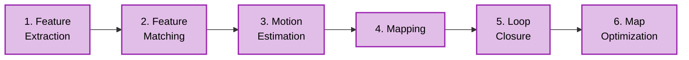

# Module 3 Diagram Style Guide

This guide defines the visual standards for all diagrams in Module 3 to ensure consistency and readability across chapters.

## Color Scheme (FR-033)

All diagrams follow a consistent color-coding system to help students quickly identify component types:

| Component Type | Color | Hex Code | Usage |
|----------------|-------|----------|-------|
| **Perception Nodes** | Purple | `#9c27b0` | VSLAM nodes, feature extraction, object detection |
| **Planning Nodes** | Orange | `#ff9800` | Nav2 planners, path planning, decision-making |
| **Sensor Data** | Green | `#4caf50` | Camera streams, LiDAR, depth sensors, raw sensor topics |
| **Commands** | Red | `#ff5722` | Velocity commands, action goals, control signals |
| **Simulation** | Blue | `#0084c7` | Isaac Sim components, simulation engine |
| **Data Topics** | Yellow | `#fbc02d` | ROS 2 topics, transform data, intermediate outputs |
| **Robot Hardware** | Gray | `#607d8b` | Physical robot components, actuators, base controller |

## Diagram Types

### 1. ROS 2 Topic Flow Diagrams (Mermaid.js)

**Purpose**: Show data flow between ROS 2 nodes via topics

**Format**: Mermaid.js `graph LR` (left-to-right flow)

**Example**:
```mermaid
graph LR
    CameraSensor[Camera Sensor]:::sensor
    ImageTopic[/camera/image_raw]:::data
    VSLAMNode[visual_slam_node]:::perception
    OdomTopic[/odometry]:::data

    CameraSensor -->|RGB Images| ImageTopic
    ImageTopic --> VSLAMNode
    VSLAMNode -->|Position| OdomTopic

    classDef sensor fill:#c8e6c9,stroke:#4caf50,stroke-width:2px,color:#000
    classDef data fill:#fff9c4,stroke:#fbc02d,stroke-width:2px,color:#000
    classDef perception fill:#e1bee7,stroke:#9c27b0,stroke-width:3px,color:#000
```

**Guidelines**:
- Nodes: Use descriptive names (e.g., `visual_slam_node`, not `node1`)
- Topics: Enclose in forward slashes (e.g., `/camera/image_raw`)
- Arrows: Label with data type or description
- Color classes: Apply using `:::classname` syntax

### 2. Architecture Diagrams (SVG from Draw.io)

**Purpose**: Show system components and their relationships

**Format**: SVG exported from Draw.io or diagrams.net

**Guidelines**:
- **Component boxes**: Rounded rectangles with color-coded fills
- **Arrows**: Solid lines for data flow, dashed lines for control flow
- **Labels**: Clear, concise descriptions (12-14pt font)
- **Layout**: Top-to-bottom or left-to-right (consistent within chapter)
- **File naming**: `{topic}-architecture.svg` (e.g., `isaac-sim-architecture.svg`)

**Example Structure**:
```
┌─────────────────────────────────────┐
│   Isaac Sim Simulation Engine       │ (Blue)
│  ┌───────────┐  ┌──────────────┐   │
│  │ Rendering │  │ Physics      │   │
│  └───────────┘  └──────────────┘   │
└─────────────────────────────────────┘
            ↓
┌─────────────────────────────────────┐
│   Sensor Simulation                 │ (Green)
│  ┌───────┐  ┌────────┐  ┌────────┐ │
│  │ RGB   │  │ Depth  │  │ Seg.   │ │
│  └───────┘  └────────┘  └────────┘ │
└─────────────────────────────────────┘
            ↓
    ROS 2 Bridge → /camera/image_raw
```

### 3. Pipeline Flow Diagrams (Mermaid.js or SVG)

**Purpose**: Show sequential stages of a process (e.g., VSLAM pipeline)

**Format**: Mermaid.js `flowchart LR` or SVG with numbered stages

**Example** (VSLAM Pipeline):


**Guidelines**:
- **Numbered stages**: Prefix with step number (1, 2, 3...)
- **Brief labels**: 2-3 words maximum per stage
- **Consistent width**: All boxes same size for visual balance

### 4. Cost Map Visualizations (Screenshot or SVG)

**Purpose**: Show Nav2 cost map layers and obstacle representation

**Format**: Annotated screenshots from RViz or custom SVG grid visualization

**Guidelines**:
- **Grid cells**: Clearly visible cell boundaries
- **Color legend**: Include legend showing free (white), occupied (black), inflated (gray gradient), unknown (yellow)
- **Annotations**: Arrow labels pointing to key features (obstacles, robot footprint, inflation radius)
- **File naming**: `costmap-{feature}.png` (e.g., `costmap-inflation-layer.png`)

## File Organization

### Storage Locations
- **Mermaid.js diagrams**: Embedded directly in MDX chapter files
- **SVG diagrams**: Stored in `static/img/module-3/`
- **Screenshots**: Stored in `static/img/module-3/screenshots/`

### File Naming Conventions
- Architecture diagrams: `{component}-architecture.svg`
- Pipeline diagrams: `{process}-pipeline.svg`
- Screenshots: `{tool}-{feature}-{number}.png`

### Examples
```
static/img/module-3/
├── isaac-sim-architecture.svg
├── isaac-sim-pipeline.svg
├── vslam-pipeline.svg
├── isaac-ros-architecture.svg
├── vslam-tf-tree.svg
├── nav2-architecture.svg
├── nav2-costmap.svg
├── nav2-planning-comparison.svg
└── screenshots/
    ├── isaac-ui-scene-hierarchy.png
    ├── isaac-ui-viewport.png
    ├── rviz-vslam-trajectory.png
    └── costmap-inflation-layer.png
```

## Accessibility Guidelines

### Text Readability
- **Minimum font size**: 12pt for labels
- **High contrast**: Use dark text on light backgrounds or vice versa
- **Avoid color-only differentiation**: Use shapes or labels in addition to color

### Alt Text (for MDX embedding)
Always provide descriptive alt text for images:

```mdx

```

### Responsive Design
- **SVG preferred**: Scalable for mobile and desktop viewing
- **Max width**: 1200px for large diagrams
- **Min width**: 600px (ensure readability on tablets)

## Quality Checklist

Before finalizing any diagram, verify:

- [ ] Colors match the defined scheme (purple/orange/green/red/blue/yellow/gray)
- [ ] All nodes/components are clearly labeled
- [ ] Arrows show direction of data/control flow
- [ ] Font size is readable (minimum 12pt)
- [ ] File format is correct (Mermaid.js in MDX or SVG in static/)
- [ ] File name follows naming convention
- [ ] Alt text provided for accessibility
- [ ] Diagram referenced in chapter content with clear context

## Example: Complete Diagram Workflow

### 1. Create Mermaid.js Diagram in MDX
```mdx
## VSLAM Pipeline Architecture

The Visual SLAM pipeline consists of six sequential stages that transform raw camera images into accurate robot localization:

```mermaid
graph LR
    Input[Camera Image]:::sensor
    Stage1[Feature Extraction]:::perception
    Stage2[Feature Matching]:::perception
    Stage3[Motion Estimation]:::perception
    Stage4[Mapping]:::perception
    Stage5[Loop Closure]:::perception
    Stage6[Optimization]:::perception
    Output[Odometry + Map]:::data

    Input --> Stage1 --> Stage2 --> Stage3 --> Stage4 --> Stage5 --> Stage6 --> Output

    classDef sensor fill:#c8e6c9,stroke:#4caf50,stroke-width:2px,color:#000
    classDef perception fill:#e1bee7,stroke:#9c27b0,stroke-width:3px,color:#000
    classDef data fill:#fff9c4,stroke:#fbc02d,stroke-width:2px,color:#000
\```

Each stage processes the output of the previous stage...
\```

### 2. Create SVG Diagram in Draw.io

1. Open diagrams.net
2. Create new diagram
3. Use color palette: purple `#9c27b0`, orange `#ff9800`, green `#4caf50`, etc.
4. Add components, arrows, labels
5. Export as SVG: File → Export as → SVG
6. Save to `static/img/module-3/isaac-sim-architecture.svg`
7. Embed in MDX:

```mdx

```

## Version History

- **v1.0 (2025-12-09)**: Initial style guide created for Module 3 implementation
