# Capstone Project: The Autonomous Humanoid

## Learning Objectives

By the end of this chapter, you will be able to:

- **Trace** data flow through the complete VLA pipeline (voice → planning → execution)
- **Identify** integration points between Whisper, LLM, and robot systems
- **Explain** timing and latency considerations for real-time interaction
- **Design** a capstone fetch-and-deliver system using all learned concepts
- **Implement** failure recovery strategies for VLA pipelines
- **Compare** educational VLA systems with production deployments

**Estimated Time**: 60-90 minutes

---

## Prerequisites

- **Chapter 1**: Whisper voice command transcription
- **Chapter 2**: LLM-based cognitive planning
- **Modules 1-3**: ROS 2, simulation, perception, navigation
- **System Integration**: Understanding of multi-component software systems

---

## Complete VLA Pipeline Architecture

### High-Level Overview

```mermaid
flowchart TB
    User[🎤 User Voice Command]:::user
    Mic[Microphone Hardware]:::hardware
    Audio[Audio Processing]:::process
    Whisper[Whisper Model<br/>Speech-to-Text]:::ai
    Text[Text Command]:::data
    LLM[LLM Planner<br/>Task Decomposition]:::ai
    Plan[Action Plan JSON]:::data
    Validator[Plan Validator]:::process
    Executor[Action Executor]:::process
    Nav[Navigation<br/>Nav2]:::robot
    Perception[Perception<br/>Isaac ROS / YOLO]:::robot
    Manipulation[Manipulation<br/>MoveIt]:::robot
    Sensors[Robot Sensors<br/>Camera, LiDAR, IMU]:::hardware
    Feedback[Execution Feedback]:::data
    User2[🔊 Robot Response<br/>Speech / Display]:::user

    User --> Mic
    Mic --> Audio
    Audio --> Whisper
    Whisper --> Text
    Text --> LLM
    LLM --> Plan
    Plan --> Validator
    Validator -->|Valid| Executor
    Validator -->|Invalid| LLM
    Executor --> Nav
    Executor --> Perception
    Executor --> Manipulation
    Sensors --> Perception
    Nav --> Feedback
    Perception --> Feedback
    Manipulation --> Feedback
    Feedback --> Executor
    Feedback --> User2

    classDef user fill:#e1f5e1,stroke:#4caf50,stroke-width:2px
    classDef hardware fill:#fff3cd,stroke:#ffc107,stroke-width:2px
    classDef process fill:#cfe2ff,stroke:#0d6efd,stroke-width:2px
    classDef ai fill:#f8d7da,stroke:#dc3545,stroke-width:2px
    classDef data fill:#d1ecf1,stroke:#0dcaf0,stroke-width:2px
    classDef robot fill:#e7d6f8,stroke:#6f42c1,stroke-width:2px
```



---

## Data Flow Through VLA Pipeline

### Stage 1: Voice Capture (0-1 seconds)

**Input**: User speaks "Bring me a drink from the kitchen"

**Hardware**: Microphone captures audio waveform
- Sample rate: 16kHz
- Format: WAV, FLAC, or raw PCM
- Duration: 1-10 seconds

**ROS 2 Topic**: `/audio/input` (`audio_msgs/Audio`)

```python
# Audio capture node (simplified)
class AudioCapture(Node):
    def __init__(self):
        super().__init__('audio_capture')
        self.publisher = self.create_publisher(Audio, '/audio/input', 10)

        # Record audio when voice detected
        self.record_audio()

    def record_audio(self):
        import pyaudio

        audio = pyaudio.PyAudio()
        stream = audio.open(format=pyaudio.paInt16,
                           channels=1,
                           rate=16000,
                           input=True,
                           frames_per_buffer=1024)

        # Record for 5 seconds or until silence
        frames = []
        for i in range(0, int(16000 / 1024 * 5)):
            data = stream.read(1024)
            frames.append(data)

        # Publish to ROS 2
        msg = Audio()
        msg.data = b''.join(frames)
        self.publisher.publish(msg)
```

---

### Stage 2: Speech Recognition (1-3 seconds)

**Input**: Audio waveform from `/audio/input`

**Processing**: Whisper model transcribes audio to text
- Model: whisper-base (74M params)
- Latency: 1-2 seconds on GPU
- Accuracy: 90-95% for clear speech

**Output**: Text string "bring me a drink from the kitchen"

**ROS 2 Topic**: `/voice_command/text` (`std_msgs/String`)

```python
# Whisper node
class WhisperNode(Node):
    def __init__(self):
        super().__init__('whisper_node')
        self.subscription = self.create_subscription(
            Audio, '/audio/input', self.audio_callback, 10)
        self.publisher = self.create_publisher(
            String, '/voice_command/text', 10)

        import whisper
        self.model = whisper.load_model("base")

    def audio_callback(self, msg):
        # Transcribe audio
        result = self.model.transcribe(msg.data)
        text = result["text"]

        # Publish text
        text_msg = String()
        text_msg.data = text
        self.publisher.publish(text_msg)

        self.get_logger().info(f'Transcribed: {text}')
```

---

### Stage 3: Cognitive Planning (2-8 seconds)

**Input**: Text command from `/voice_command/text`

**Processing**: LLM decomposes task into action sequence
- Model: GPT-4 or Claude 3
- Latency: 3-7 seconds (cloud API)
- Context: Robot capabilities + current state

**Output**: JSON action plan

```json
{
  "task": "bring drink from kitchen",
  "actions": [
    {"action": "navigate", "params": {"location": "kitchen"}, "timeout": 30},
    {"action": "detect_objects", "params": {"type": "drink"}, "timeout": 5},
    {"action": "grasp_object", "params": {"object_id": "auto"}, "timeout": 10},
    {"action": "navigate", "params": {"location": "user"}, "timeout": 30},
    {"action": "handover", "params": {}, "timeout": 5}
  ],
  "estimated_duration": 80,
  "failure_strategy": "replan_on_error"
}
```

**ROS 2 Topic**: `/cognitive_plan/actions` (`custom_msgs/ActionPlan`)

---

### Stage 4: Plan Validation (0.1-0.5 seconds)

**Input**: Action plan JSON

**Processing**: Validate against constraints
- All actions in capability list?
- Parameters valid (locations exist, objects reachable)?
- Safety constraints met (no collisions, battery sufficient)?

**Output**: Valid plan or error message

```python
def validate_plan(plan, robot_state, environment):
    """
    Validate plan before execution
    """
    for action in plan["actions"]:
        # Check action exists
        if action["action"] not in CAPABILITIES:
            return False, f"Unknown action: {action['action']}"

        # Check location exists
        if action["action"] == "navigate":
            loc = action["params"]["location"]
            if loc not in environment.known_locations:
                return False, f"Unknown location: {loc}"

        # Check battery
        if robot_state.battery < plan["estimated_duration"] * 0.5:
            return False, "Insufficient battery"

    return True, "Plan valid"
```

---

### Stage 5: Action Execution (30-120 seconds)

**Input**: Validated action plan

**Processing**: Execute each action sequentially

#### Action 1: Navigate to Kitchen (20-40 seconds)

```python
# Call Nav2
goal = NavigateToPose.Goal()
goal.pose.pose.position.x = LOCATIONS["kitchen"]["x"]
goal.pose.pose.position.y = LOCATIONS["kitchen"]["y"]
goal.pose.pose.orientation.w = 1.0

nav_client.send_goal_async(goal)
# Wait for completion...
```

**Sensors Used**: LiDAR, IMU, odometry
**Data Flow**: Nav2 publishes `/cmd_vel`, robot moves

#### Action 2: Detect Objects (2-5 seconds)

```python
# Call Isaac ROS or YOLO detector
detection_msg = DetectObjects.Request()
detection_msg.object_type = "drink"

response = detector_client.call(detection_msg)
detected_objects = response.objects

# Select closest object
target = min(detected_objects, key=lambda obj: obj.distance)
```

**Sensors Used**: RGB camera, depth camera
**Data Flow**: Vision pipeline publishes `/detections`, returns object pose

#### Action 3: Grasp Object (5-15 seconds)

```python
# Call MoveIt for manipulation
grasp_goal = Grasp.Goal()
grasp_goal.target_pose = target.pose
grasp_goal.approach_direction = "top"

manipulation_client.send_goal_async(grasp_goal)
# Move arm, close gripper...
```

**Sensors Used**: Joint encoders, force/torque sensors
**Data Flow**: Joint trajectories published to `/joint_trajectory_controller`

#### Action 4: Navigate Back (20-40 seconds)

Same as Action 1, but target is user location.

#### Action 5: Handover (3-8 seconds)

```python
# Extend arm to user
handover_goal = Handover.Goal()
handover_goal.recipient = "user"

# Wait for user to grasp (force sensor detects pull)
# Open gripper
```

---

### Stage 6: Feedback and Completion (0.5-2 seconds)

**Output**: Status message to user

```python
# Text-to-speech
tts_msg = String()
tts_msg.data = "Here is your drink"
speech_publisher.publish(tts_msg)

# Or display on screen
display_msg = String()
display_msg.data = "Task completed successfully"
display_publisher.publish(display_msg)
```

**Total Pipeline Latency**: 60-180 seconds (1-3 minutes)

---

## Timing and Latency Breakdown

| Stage | **Component** | **Latency** | **Type** |
|-------|---------------|-------------|----------|
| 1 | Audio capture | 1-5s | Real-time |
| 2 | Whisper transcription | 1-3s | Near real-time |
| 3 | LLM planning | 3-10s | Batch |
| 4 | Plan validation | 0.1-0.5s | Real-time |
| 5a | Navigation (kitchen) | 20-40s | Real-time |
| 5b | Object detection | 2-5s | Near real-time |
| 5c | Manipulation | 5-15s | Real-time |
| 5d | Navigation (return) | 20-40s | Real-time |
| 5e | Handover | 3-8s | Real-time |
| 6 | Feedback | 0.5-2s | Real-time |
| **Total** | **End-to-end** | **60-180s** | **Interactive** |

### Latency Optimization Strategies

**For Whisper** (1-3s → 0.5-1s):
- Use smaller model (tiny, base)
- Run on GPU
- Stream audio chunks (incremental transcription)

**For LLM** (3-10s → 1-3s):
- Use faster model (GPT-3.5 vs GPT-4)
- Cache common plans
- Run local model (Llama, Mistral)

**For Actions** (30-120s → 20-80s):
- Parallel execution where possible
- Pre-position robot near likely target areas
- Optimize motion planning parameters

---

## Capstone Project: Fetch-and-Deliver Robot

### Project Overview

**Goal**: Build a humanoid robot that responds to voice commands to fetch objects and deliver them to users.

**Scenario**: Home assistant robot in living space with:
- Multiple rooms (kitchen, living room, bedroom)
- Various objects (cups, bottles, books, remotes)
- Human user giving voice commands

### System Architecture

```
┌─────────────────────────────────────────────────────────┐
│                   Capstone System                       │
│                                                         │
│  ┌────────────┐   ┌─────────────┐   ┌──────────────┐   │
│  │  Whisper   │──▶│ LLM Planner │──▶│  Action      │   │
│  │  (Ch 1)    │   │  (Ch 2)     │   │  Executor    │   │
│  └────────────┘   └─────────────┘   └──────┬───────┘   │
│                                             │           │
│  ┌──────────────────────────────────────────┼──────┐    │
│  │         Robot Capabilities (Modules 1-3) │      │    │
│  │                                          ▼      │    │
│  │  ┌─────────┐  ┌────────────┐  ┌──────────────┐│    │
│  │  │  Nav2   │  │ Isaac ROS  │  │   MoveIt     ││    │
│  │  │Navigation│  │ Perception │  │ Manipulation ││    │
│  │  └─────────┘  └────────────┘  └──────────────┘│    │
│  │                                                │    │
│  │  ┌──────────────────────────────────────────┐ │    │
│  │  │  ROS 2 (Module 1): Topics, Services,    │ │    │
│  │  │  Actions, Parameters                     │ │    │
│  │  └──────────────────────────────────────────┘ │    │
│  │                                                │    │
│  │  ┌──────────────────────────────────────────┐ │    │
│  │  │  Simulation (Module 2): Gazebo, Unity    │ │    │
│  │  │  Sensors: LiDAR, Depth, IMU              │ │    │
│  │  └──────────────────────────────────────────┘ │    │
│  └────────────────────────────────────────────────┘    │
└─────────────────────────────────────────────────────────┘
```

---

## Technology Mapping

### From Modules 1-3 to Capstone

**Module 1 (ROS 2 Basics)**:
- ✅ Nodes: Whisper node, LLM planner node, executor node
- ✅ Topics: `/audio/input`, `/voice_command/text`, `/cmd_vel`
- ✅ Services: Object detection, grasp planning
- ✅ Actions: Navigation, manipulation
- ✅ URDF: Humanoid robot model

**Module 2 (Digital Twin)**:
- ✅ Gazebo: Physics simulation for testing
- ✅ Unity: Photorealistic visualization for demos
- ✅ Sensors: Camera (object detection), LiDAR (navigation), IMU (balance)

**Module 3 (Perception & Navigation)** (assumed existing):
- ✅ Isaac ROS VSLAM: Visual localization
- ✅ Nav2: Path planning and obstacle avoidance
- ✅ YOLO: Object detection

**Module 4 (VLA)**:
- ✅ Whisper: Voice-to-text
- ✅ LLM: Cognitive planning
- ✅ Integration: End-to-end pipeline

---

## Capstone Implementation Phases

### Phase 1: Simulation Setup (2-4 hours)

1. Create Gazebo world with rooms and objects
2. Spawn humanoid robot with sensors
3. Verify Nav2 navigation works
4. Test object detection with camera

**Deliverable**: Robot navigates and detects objects in simulation

---

### Phase 2: Voice Interface (2-3 hours)

1. Integrate Whisper node
2. Test voice commands in simulation
3. Handle transcription errors

**Deliverable**: Voice commands transcribed to text topics

---

### Phase 3: LLM Planning (3-5 hours)

1. Create LLM planner node with OpenAI/Anthropic API
2. Define robot capability prompts
3. Implement plan validation
4. Test with sample commands

**Deliverable**: Text commands → valid action plans

---

### Phase 4: Action Execution (4-6 hours)

1. Implement action executor node
2. Connect to Nav2 for navigation
3. Connect to MoveIt for manipulation
4. Add error handling

**Deliverable**: Plans execute successfully in simulation

---

### Phase 5: End-to-End Testing (2-3 hours)

1. Test complete pipeline voice → execution
2. Handle failure cases
3. Optimize latency
4. Add user feedback (speech synthesis)

**Deliverable**: Complete fetch-and-deliver demo

---

### Phase 6: Hardware Deployment (Optional, 5-10 hours)

1. Deploy to real humanoid robot
2. Calibrate sensors
3. Tune navigation and manipulation
4. Safety testing

**Deliverable**: Working robot in real environment

---

## Failure Modes and Recovery

### Failure 1: Speech Recognition Error

**Symptom**: Whisper misrecognizes command
- "Navigate to kitchen" → "Navigate to chicken"

**Detection**: LLM validation fails (no location "chicken")

**Recovery**:
```python
if validation_failed:
    # Request clarification
    tts("I didn't understand. Did you say kitchen?")
    # Wait for confirmation
```

---

### Failure 2: LLM Hallucination

**Symptom**: LLM suggests impossible action
- "Fly to the roof"

**Detection**: Action not in capability list

**Recovery**:
```python
if action not in CAPABILITIES:
    # Requery with explicit constraint
    prompt += "\nReminder: Robot cannot fly. Use navigation only."
    new_plan = query_llm(prompt)
```

---

### Failure 3: Navigation Failure

**Symptom**: Robot stuck, path blocked

**Detection**: Nav2 returns failure status

**Recovery**:
```python
if nav_failed:
    # Replan with updated costmap
    # Or request user assistance
    tts("Path is blocked. Please clear the way.")
```

---

### Failure 4: Object Not Found

**Symptom**: Detector finds no objects matching description

**Detection**: Empty detection list

**Recovery**:
```python
if len(detections) == 0:
    # Ask LLM to replan
    feedback = "No drinks found in kitchen"
    new_plan = query_llm(f"Failed: {feedback}. Try alternative location?")
```

---

### Failure 5: Grasp Failure

**Symptom**: Object slips, gripper misses

**Detection**: Force sensor shows no object weight

**Recovery**:
```python
if not gripper.has_object():
    # Retry grasp
    for attempt in range(3):
        result = retry_grasp(target)
        if result.success:
            break
    else:
        # Give up, notify user
        tts("I couldn't pick up the object. Please help.")
```

---

## Real-World Deployment Considerations

### Model Quantization

**Problem**: Large models slow on embedded hardware

**Solution**: Quantize to INT8 or INT4
- Whisper: 480MB → 120MB (INT8)
- LLM: Run on cloud, only edge models local

```python
# Quantize Whisper model
import torch
from torch.quantization import quantize_dynamic

model = whisper.load_model("base")
quantized_model = quantize_dynamic(
    model, {torch.nn.Linear}, dtype=torch.qint8
)
```

---

### Cloud vs Local Processing

| Component | **Cloud** | **Local (Edge)** |
|-----------|-----------|------------------|
| **Whisper** | 500ms, always accurate | 2s, works offline |
| **LLM** | 3s, powerful models | 10s, smaller models |
| **Pros** | Fast, no hardware cost | Privacy, no latency spikes |
| **Cons** | Requires internet | Limited model size |

**Recommended**: Hybrid
- Whisper: Local (privacy, latency)
- LLM: Cloud (quality), with local fallback

---

### Safety and Ethics

**Privacy**: Voice data handling
- Store audio locally only
- Explicit user consent
- No cloud upload without permission

**Safety**: Physical robot interactions
- E-stop button accessible
- Collision detection always active
- Maximum speed limits enforced

**Transparency**: Explain decisions
- Show LLM plan before execution
- Allow user to approve/reject
- Log all actions for review

---

## Summary

**Key Takeaways**:

1. **VLA Pipeline**: Voice (Whisper) → Planning (LLM) → Action (ROS 2)
2. **Data Flow**: Audio → Text → Plan JSON → ROS 2 actions → Robot motion
3. **Latency**: 60-180 seconds end-to-end for fetch-and-deliver
4. **Capstone Project**: Integrates all modules (ROS 2, simulation, perception, navigation, VLA)
5. **Failure Recovery**: Handle speech errors, planning failures, execution failures
6. **Deployment**: Consider quantization, cloud vs local, safety, privacy

**Congratulations!** 🎉 You've completed Module 4 and the entire course. You now understand:
- ROS 2 fundamentals (Module 1)
- Digital twin simulation (Module 2)
- Perception and navigation (Module 3)
- Vision-Language-Action pipelines (Module 4)

---

## Next Steps

### Advanced Topics to Explore

1. **Reinforcement Learning for VLA**:
   - Train LLM with RL for better planning
   - Use Unity ML-Agents for policy learning

2. **Vision-Language Models**:
   - Integrate camera feed directly into planning (GPT-4V, LLaVA)
   - Visual grounding of commands

3. **Multi-Robot Systems**:
   - Coordinate multiple robots with shared LLM planner
   - Distributed task allocation

4. **Continual Learning**:
   - Robot learns from feedback
   - Update LLM system prompts based on experience

---

## Troubleshooting

**Problem**: End-to-end latency too high (>3 minutes)

**Solutions**:
1. Profile each stage to find bottleneck
2. Use faster models (Whisper tiny, GPT-3.5)
3. Parallelize where possible (start navigation while LLM plans next step)

**Problem**: Frequent plan validation failures

**Solutions**:
1. Improve LLM system prompt with more examples
2. Add few-shot examples of valid plans
3. Implement automatic repair (LLM suggests fix)

**Problem**: Robot gets stuck in failure loops

**Solutions**:
1. Add maximum retry limits
2. Escalate to human operator after 3 failures
3. Implement "give up gracefully" behavior

---

## Further Reading

- [RT-2 Paper: Vision-Language-Action Models](https://arxiv.org/abs/2307.15818)
- [SayCan: Grounded Language in Robotic Affordances](https://say-can.github.io/)
- [PaLM-E: Embodied Multimodal Language Model](https://palm-e.github.io/)
- [ROS 2 Humble Documentation](https://docs.ros.org/en/humble/)

---

**Course Complete!** ✅ You've mastered humanoid robotics with AI integration. Continue building, experimenting, and innovating in the field of intelligent robotics!
