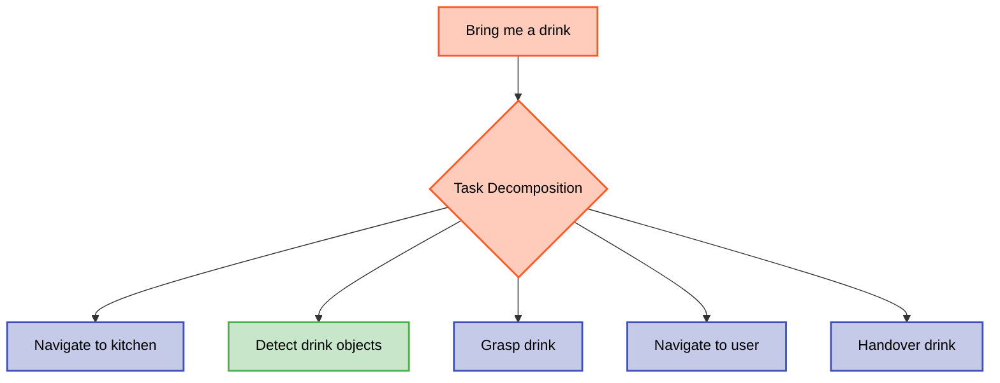

# Module 4 Diagram Style Guide

This guide defines the visual standards for all diagrams in Module 4 to ensure consistency and readability across chapters.

## Color Scheme

All diagrams follow a consistent color-coding system to help students quickly identify component types:

| Component Type | Color | Hex Code | Usage |
|----------------|-------|----------|-------|
| **Voice Input** | Teal | `#009688` | Microphone, audio capture, speech input |
| **Whisper/Speech** | Purple | `#9c27b0` | Whisper model, transcription, ASR nodes |
| **LLM/Planning** | Deep Orange | `#ff5722` | LLM inference, cognitive planning, task decomposition |
| **Action Execution** | Indigo | `#3f51b5` | ROS 2 actions, robot commands, execution nodes |
| **Perception** | Green | `#4caf50` | Object detection, scene understanding, feedback sensors |
| **Data Topics** | Yellow | `#fbc02d` | ROS 2 topics, text messages, intermediate data |
| **Feedback Loop** | Blue | `#2196f3` | Sensor feedback, confirmation signals, status updates |

## Diagram Types

### 1. VLA Pipeline Diagrams (Mermaid.js)

**Purpose**: Show end-to-end data flow from voice to action execution

**Format**: Mermaid.js `flowchart LR` (left-to-right flow)

**Example**:
```mermaid
flowchart LR
    Mic[Microphone]:::voice
    Audio[/audio/input]:::data
    Whisper[whisper_node]:::speech
    Text[/voice_command/<br/>transcription]:::data
    LLM[llm_planner_node]:::llm
    Plan[/cognitive_plan/<br/>output]:::data
    Action[Action Server]:::action

    Mic -->|Audio Stream| Audio
    Audio --> Whisper
    Whisper -->|Text| Text
    Text --> LLM
    LLM -->|JSON Plan| Plan
    Plan --> Action

    classDef voice fill:#b2dfdb,stroke:#009688,stroke-width:2px,color:#000
    classDef speech fill:#e1bee7,stroke:#9c27b0,stroke-width:3px,color:#000
    classDef llm fill:#ffccbc,stroke:#ff5722,stroke-width:3px,color:#000
    classDef data fill:#fff9c4,stroke:#fbc02d,stroke-width:2px,color:#000
    classDef action fill:#c5cae9,stroke:#3f51b5,stroke-width:3px,color:#000
```

**Guidelines**:
- Nodes: Use descriptive names (e.g., `whisper_node`, `llm_planner_node`)
- Topics: Enclose in forward slashes (e.g., `/voice_command/transcription`)
- Arrows: Label with data type or description
- Color classes: Apply using `:::classname` syntax

### 2. Architecture Diagrams (Mermaid.js or SVG)

**Purpose**: Show system components and their relationships

**Format**: Mermaid.js `graph TD` (top-down) or SVG from Draw.io

**Guidelines**:
- **Component boxes**: Rounded rectangles with color-coded fills
- **Arrows**: Solid lines for data flow, dashed lines for optional/feedback paths
- **Labels**: Clear, concise descriptions (12-14pt font)
- **Layout**: Top-to-bottom for VLA stages (Voice → Language → Action)

### 3. Prompt Engineering Templates (Text Diagrams)

**Purpose**: Visualize LLM prompt structure and components

**Format**: Code blocks with annotations

**Example**:
```
┌─────────────────────────────────────────┐
│ System Prompt (Robot Capabilities)     │
│ - Available actions: navigate, grasp   │
│ - Object types: cup, bottle, door      │
│ - Constraints: collision avoidance     │
└─────────────────────────────────────────┘
            ↓
┌─────────────────────────────────────────┐
│ User Command (Voice Transcription)      │
│ "Bring me a cup from the kitchen"      │
└─────────────────────────────────────────┘
            ↓
┌─────────────────────────────────────────┐
│ LLM Output (Structured JSON)           │
│ {                                       │
│   "steps": [                            │
│     {"action": "navigate", "target": ...}│
│     {"action": "grasp", "object": ...}  │
│   ]                                     │
│ }                                       │
└─────────────────────────────────────────┘
```

### 4. Task Decomposition Flowcharts (Mermaid.js)

**Purpose**: Show how LLMs break down high-level commands into subtasks

**Format**: Mermaid.js `flowchart TD`

**Example**:


## File Organization

### Storage Locations
- **Mermaid.js diagrams**: Embedded directly in MDX chapter files
- **SVG diagrams**: Stored in `static/img/module-4/`
- **Screenshots**: Stored in `static/img/module-4/screenshots/`

### File Naming Conventions
- Architecture diagrams: `{component}-architecture.svg`
- Pipeline diagrams: `{process}-pipeline.svg`
- Template visualizations: `{topic}-template.svg`

### Examples
```
static/img/module-4/
├── whisper-architecture.svg
├── whisper-pipeline.svg
├── llm-task-decomposition.svg
├── llm-prompt-template.svg
├── vla-pipeline-complete.svg
├── capstone-architecture.svg
└── screenshots/
    ├── whisper-model-comparison.png
    └── llm-output-example.png
```

## Accessibility Guidelines

### Text Readability
- **Minimum font size**: 12pt for labels
- **High contrast**: Use dark text on light backgrounds
- **Avoid color-only differentiation**: Use shapes or labels in addition to color

### Alt Text (for MDX embedding)
Always provide descriptive alt text for images:

```mdx

```

### Responsive Design
- **SVG preferred**: Scalable for mobile and desktop viewing
- **Max width**: 1200px for large diagrams
- **Min width**: 600px (ensure readability on tablets)

## Quality Checklist

Before finalizing any diagram, verify:

- [ ] Colors match the defined scheme (teal/purple/orange/indigo/green/yellow/blue)
- [ ] All nodes/components are clearly labeled
- [ ] Arrows show direction of data/control flow
- [ ] Font size is readable (minimum 12pt)
- [ ] File format is correct (Mermaid.js in MDX or SVG in static/)
- [ ] File name follows naming convention
- [ ] Alt text provided for accessibility
- [ ] Diagram referenced in chapter content with clear context

## VLA-Specific Guidelines

### Whisper Architecture Diagrams
- Show encoder-decoder transformer structure conceptually
- Use purple for Whisper components
- Label audio input (teal) and text output (yellow data topic)

### LLM Planning Diagrams
- Show prompt structure (system + user input → output)
- Use deep orange for LLM inference components
- Clearly distinguish structured JSON outputs from natural language

### End-to-End VLA Pipeline
- Include all stages: Voice → Speech → Language → Action → Feedback
- Use color progression: teal → purple → orange → indigo → blue (feedback)
- Show ROS 2 topic names at each stage

## Version History

- **v1.0 (2025-12-09)**: Initial style guide created for Module 4 implementation, adapted from Module 3 standards
