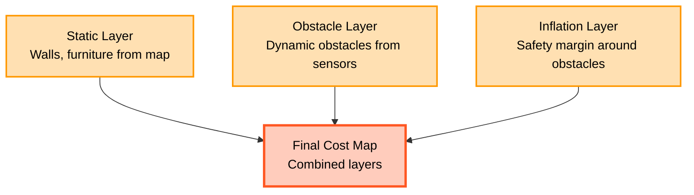

# Chapter 3: Nav2 Humanoid Navigation

:::tip Learning Objectives
After completing this chapter (estimated 20 minutes), you should be able to:
- **Describe** the Nav2 navigation pipeline (localization → global planning → local planning → control)
- **Explain** cost map representation (2D occupancy grid, static/dynamic/inflation layers)
- **Compare** global path planning algorithms (A*, Dijkstra) and local planners (DWB, TEB)
- **Identify** key ROS 2 topics for navigation (`/goal_pose`, `/cmd_vel`, `/plan`, cost maps)
- **Evaluate** humanoid-specific navigation considerations (footstep planning, bipedal stability, rectangular footprint)
:::

## Introduction

In Chapter 1, you learned to generate synthetic training data. In Chapter 2, you learned how VSLAM provides accurate robot localization. Now comes the ultimate goal: **autonomous navigation**—enabling the robot to move from point A to point B while avoiding obstacles.

**Nav2** (Navigation2) is the ROS 2 navigation stack that combines:

1. **Localization** (VSLAM or AMCL) to know where the robot is
2. **Cost maps** to represent the environment (obstacles, free space, safety margins)
3. **Global planning** to find optimal paths from start to goal
4. **Local planning** to generate dynamic trajectories that avoid moving obstacles
5. **Control** to execute trajectories by sending velocity commands to the robot

While Nav2 was originally designed for **wheeled robots** (differential drive, Ackermann steering), it can be adapted for **humanoid robots** with bipedal locomotion. This chapter covers:

✅ Nav2 architecture and pipeline stages
✅ Cost map layers (static, obstacle, inflation)
✅ Global planning algorithms (A*, Dijkstra, Smac Planner)
✅ Local planning for obstacle avoidance (DWB, TEB)
✅ Humanoid navigation considerations (footstep planning, stability, rectangular footprint)
✅ Common failure modes and debugging strategies

:::note Prerequisites
Before starting this chapter, you should have:
- Completed **Chapter 1** (Isaac Sim) and **Chapter 2** (VSLAM localization)
- **Module 1** knowledge (ROS 2 topics, nodes, TF transforms, action servers)
- Basic understanding of **graph search algorithms** (breadth-first search, Dijkstra)
- Familiarity with **coordinate frames** and **robot kinematics**

**No physical robot or Nav2 installation is required**—you can learn the concepts without hands-on execution. If you do have a robot or simulator (Gazebo, Isaac Sim), Nav2 installation instructions are at [Nav2 Documentation](https://navigation.ros.org/) [Nav2Docs].
:::

---

## 3.1 Nav2 Architecture

Nav2 is a modular navigation system with multiple components (servers) that communicate via ROS 2 topics and action servers. The pipeline consists of four main stages:

```mermaid
graph TD
    Localization[Localization<br/>VSLAM or AMCL]:::perception
    Pose[Robot Pose<br/>TF: map → odom]:::data

    Nav2Stack[Nav2 Navigation Stack]:::planning
    GlobalPlanner[Global Planner<br/>A*, Dijkstra, Smac]:::planning
    CostMapGlobal[Global Cost Map<br/>Static obstacles]:::data
    LocalPlanner[Local Planner<br/>DWB, TEB, MPPI]:::planning
    CostMapLocal[Local Cost Map<br/>Dynamic obstacles]:::data
    Controller[Controller Server<br/>Trajectory execution]:::planning

    GoalPose[/goal_pose<br/>PoseStamped]:::command
    GlobalPlan[/plan<br/>nav_msgs/Path]:::data
    LocalPlan[/local_plan<br/>nav_msgs/Path]:::data
    CmdVel[/cmd_vel<br/>geometry_msgs/Twist]:::command

    Robot[Robot Base<br/>Controller]:::robot

    Localization --> Pose
    Pose --> Nav2Stack
    GoalPose --> Nav2Stack

    Nav2Stack --> GlobalPlanner
    CostMapGlobal --> GlobalPlanner
    GlobalPlanner --> GlobalPlan

    GlobalPlan --> LocalPlanner
    Pose --> LocalPlanner
    CostMapLocal --> LocalPlanner
    LocalPlanner --> LocalPlan

    LocalPlan --> Controller
    Controller --> CmdVel
    CmdVel --> Robot

    classDef perception fill:#e1bee7,stroke:#9c27b0,stroke-width:2px,color:#000
    classDef planning fill:#ffe0b2,stroke:#ff9800,stroke-width:3px,color:#000
    classDef data fill:#fff9c4,stroke:#fbc02d,stroke-width:2px,color:#000
    classDef command fill:#ffccbc,stroke:#ff5722,stroke-width:2px,color:#000
    classDef robot fill:#cfd8dc,stroke:#607d8b,stroke-width:2px,color:#000
```

### Key Components

**1. Localization (VSLAM or AMCL)**

Provides the robot's pose (position + orientation) in the map frame. Nav2 requires the TF transform `map` → `odom` (from VSLAM, as covered in Chapter 2) or AMCL (for LiDAR-based localization).

**2. Global Planner**

Computes an **optimal path** from the robot's current position to the goal position. The global planner:
- Uses the **global cost map** (static obstacles, known map)
- Runs graph search algorithms (A*, Dijkstra, Smac Planner)
- Publishes the path to `/plan` (nav_msgs/Path)
- Replans if the goal changes or path is blocked

**3. Local Planner**

Generates a **short-term trajectory** (next 1-3 seconds) that:
- Follows the global plan
- Avoids dynamic obstacles (detected by sensors in real-time)
- Respects robot kinematic constraints (max velocity, acceleration)
- Publishes the local trajectory to `/local_plan`

**4. Controller Server**

Converts the local trajectory into **velocity commands** (`/cmd_vel`):
- Linear velocity (forward/backward in m/s)
- Angular velocity (rotation in rad/s)

The robot's base controller (motor drivers) subscribes to `/cmd_vel` and executes the motion.

**5. Cost Maps**

Nav2 uses two cost maps:
- **Global cost map**: Represents the entire known environment (static map from SLAM)
- **Local cost map**: Represents the robot's immediate surroundings (updated with live sensor data)

Cost maps are 2D occupancy grids where each cell has a cost value (0 = free space, 100 = occupied, 255 = unknown).

:::info Nav2 Pipeline Summary
Nav2 navigation consists of:
1. **Localization**: Know where you are (VSLAM, AMCL)
2. **Global Planning**: Find a path to the goal (A*, Dijkstra)
3. **Local Planning**: Generate dynamic trajectories (DWB, TEB)
4. **Control**: Execute trajectories via velocity commands

This pipeline runs continuously at 10-20 Hz, allowing real-time navigation in dynamic environments [Nav2Docs].
:::

---

## 3.2 Cost Map Representation

Cost maps are the foundation of Nav2 path planning. A cost map is a **2D occupancy grid** where each cell represents a square region of the environment (e.g., 5cm × 5cm).

### Cell Values

| Cell Value | Interpretation | Color (RViz) |
|------------|----------------|--------------|
| **0** | Free space (safe to navigate) | White |
| **1-99** | Inflated space (near obstacles) | Light gray gradient |
| **100** | Occupied (obstacle present) | Black |
| **255** | Unknown (unexplored area) | Yellow |

### Cost Map Layers

Nav2 cost maps consist of multiple **layers** that are combined to produce the final cost:



#### 1. Static Layer

**Source**: Pre-built map from SLAM (e.g., saved map from Chapter 2)

**Purpose**: Represents permanent obstacles (walls, furniture, structural features)

**Update frequency**: Rarely changes (only when map is reloaded)

**Example**: In an office environment, static layer includes walls, desks, and fixed shelves.

#### 2. Obstacle Layer

**Source**: Real-time sensor data (LiDAR, depth cameras, 3D point clouds)

**Purpose**: Detects dynamic obstacles (people walking, doors opening, objects moved)

**Update frequency**: 5-10 Hz (matches sensor update rate)

**Example**: A person walks into the robot's path; obstacle layer marks those cells as occupied (cost = 100).

#### 3. Inflation Layer

**Purpose**: Add a **safety margin** around obstacles to prevent collisions

**Algorithm**: For each occupied cell, mark surrounding cells within `inflation_radius` as inflated (cost = 50-99)

**Example**: If an obstacle is at cell (10, 10) and `inflation_radius = 0.5m`, all cells within 0.5m receive inflated costs (decreasing gradient from 99 near the obstacle to 1 at the boundary).

### Cost Map Parameters

```yaml
# Global Cost Map Configuration
global_costmap:
  global_frame: map
  robot_base_frame: base_link
  resolution: 0.05  # 5cm per cell
  width: 50         # 50 cells = 2.5m wide
  height: 50        # 50 cells = 2.5m tall
  plugins: ["static_layer", "obstacle_layer", "inflation_layer"]

  static_layer:
    plugin: "nav2_costmap_2d::StaticLayer"
    map_topic: "/map"  # Subscribed map from SLAM
    subscribe_to_updates: true

  obstacle_layer:
    plugin: "nav2_costmap_2d::ObstacleLayer"
    observation_sources: scan
    scan:
      topic: /scan
      max_obstacle_height: 2.0  # Ignore obstacles above 2m (e.g., ceiling)
      clearing_threshold: 0.4
      marking_threshold: 0.5

  inflation_layer:
    plugin: "nav2_costmap_2d::InflationLayer"
    inflation_radius: 0.5  # 0.5m safety margin
    cost_scaling_factor: 3.0  # Gradient steepness
```

### Visualizing Cost Maps

In RViz, cost maps appear as colored grids:
- **White cells**: Free space (cost = 0)
- **Black cells**: Obstacles (cost = 100)
- **Gray gradient**: Inflated region (cost = 1-99, darker = closer to obstacle)
- **Yellow cells**: Unknown space (cost = 255, not yet explored)


**Figure 3.1**: Nav2 cost map in RViz. Black cells are occupied obstacles (walls, furniture). Gray gradient shows the inflation layer (safety margin). White cells are free space for navigation.

---

## 3.3 Global Path Planning

The **global planner** computes an optimal path from the robot's current position to the goal position using the **global cost map** (static obstacles only).

### Graph Search Algorithms

Nav2 supports multiple global planning algorithms:

#### 1. **Dijkstra's Algorithm**

**How it works**: Expand nodes in order of cumulative cost from start, guaranteed to find the shortest path.

**Time complexity**: O(n²) where n = number of cells

**Pros**: Simple, guaranteed optimal path
**Cons**: Slow for large maps (explores all directions uniformly)

**Use case**: Small maps (<50m × 50m), when computation time is not critical

#### 2. **A* (A-Star) Algorithm**

**How it works**: Like Dijkstra, but uses a **heuristic** (Euclidean distance to goal) to prioritize exploring cells closer to the goal.

**Time complexity**: O(n log n) with good heuristics

**Pros**: Much faster than Dijkstra (10-100x speedup on large maps)
**Cons**: Requires tuning heuristic weight (over-weighting can produce suboptimal paths)

**Use case**: Most common choice for general navigation (default in Nav2)

**Algorithm**:
```python
# Pseudocode: A* pathfinding
def a_star(start, goal, cost_map):
    open_set = PriorityQueue()
    open_set.put((0, start))
    came_from = {}
    g_score = {start: 0}  # Cost from start to node

    while not open_set.empty():
        current = open_set.get()

        if current == goal:
            return reconstruct_path(came_from, current)

        for neighbor in neighbors(current):
            tentative_g = g_score[current] + cost(current, neighbor)

            if tentative_g < g_score.get(neighbor, infinity):
                came_from[neighbor] = current
                g_score[neighbor] = tentative_g
                f_score = tentative_g + heuristic(neighbor, goal)  # g + h
                open_set.put((f_score, neighbor))

    return None  # No path found
```

**Heuristic**: Euclidean distance to goal:
$$
h(n) = \sqrt{(x_{goal} - x_n)^2 + (y_{goal} - y_n)^2}
$$

#### 3. **Smac Planner (State Lattice)**

**How it works**: Plans in **configuration space** (x, y, theta) instead of just (x, y), considering robot orientation and kinematic constraints.

**Pros**:
- Generates kinematically feasible paths (respects turning radius, forward/backward motion)
- Better for non-holonomic robots (Ackermann steering, humanoids)

**Cons**: Slower than A* (explores 3D state space instead of 2D grid)

**Use case**: Robots with complex kinematics (car-like steering, humanoid footstep planning)

### Global Planning Configuration

```yaml
# Global Planner (NavFn - A* implementation)
global_planner:
  plugin: "nav2_navfn_planner::NavfnPlanner"
  tolerance: 0.5  # Goal tolerance (accept position within 0.5m of goal)
  use_astar: true  # Use A* (false = Dijkstra)
  allow_unknown: false  # Don't plan through unknown space (cost=255)
```

### Path Representation

The global plan is published as `nav_msgs/Path`:

```yaml
path:
  header:
    frame_id: "map"
  poses:
    - pose:
        position: {x: 0.0, y: 0.0, z: 0.0}  # Start
        orientation: {x: 0.0, y: 0.0, z: 0.0, w: 1.0}
    - pose:
        position: {x: 1.0, y: 0.5, z: 0.0}  # Waypoint 1
        orientation: {x: 0.0, y: 0.0, z: 0.383, w: 0.924}
    - pose:
        position: {x: 2.0, y: 1.0, z: 0.0}  # Waypoint 2
    - pose:
        position: {x: 5.0, y: 3.0, z: 0.0}  # Goal
```

Each pose includes position and orientation. The path is a sequence of waypoints to follow.

---

## 3.4 Local Path Planning and Obstacle Avoidance

The **local planner** (also called **controller**) generates short-term trajectories that:
1. Follow the global plan
2. Avoid dynamic obstacles
3. Respect robot kinematic constraints (max velocity, acceleration)

### Dynamic Window Approach (DWB)

**DWB** is the default local planner in Nav2. It evaluates multiple candidate trajectories and selects the best one based on a cost function.

**Algorithm**:
1. **Generate candidate trajectories**: Sample (v, ω) pairs (linear velocity, angular velocity) within the robot's velocity limits
2. **Simulate trajectories**: For each (v, ω), simulate robot motion for T seconds (e.g., T=1.5s)
3. **Score trajectories**: Compute cost = α × heading_cost + β × distance_cost + γ × velocity_cost
4. **Select best trajectory**: Choose trajectory with lowest cost (closest to global plan, farthest from obstacles, fastest progress)

**Cost Function**:
```python
# Pseudocode: DWB trajectory scoring
def score_trajectory(traj, global_plan, obstacles):
    heading_cost = angle_difference(traj.end_pose, global_plan.direction)
    distance_cost = distance_to_obstacles(traj, obstacles)
    velocity_cost = -traj.linear_velocity  # Negative = prefer faster

    total_cost = alpha * heading_cost + beta * distance_cost + gamma * velocity_cost
    return total_cost
```

**Parameters**:
```yaml
# DWB Local Planner Configuration
local_planner:
  plugin: "dwb_core::DWBLocalPlanner"

  # Velocity limits (humanoid robot)
  max_vel_x: 0.5  # Max forward velocity (m/s)
  min_vel_x: -0.2  # Max backward velocity (m/s)
  max_vel_y: 0.0  # No lateral motion (non-holonomic)
  max_vel_theta: 1.0  # Max rotation (rad/s)

  # Acceleration limits
  acc_lim_x: 0.5  # Linear acceleration (m/s²)
  acc_lim_theta: 1.5  # Angular acceleration (rad/s²)

  # Trajectory simulation
  sim_time: 1.5  # Simulate 1.5 seconds ahead
  sim_granularity: 0.05  # Time step (50ms)
  vx_samples: 10  # Sample 10 forward velocities
  vtheta_samples: 20  # Sample 20 angular velocities

  # Cost function weights
  PathAlign.scale: 32.0  # Follow global plan
  GoalAlign.scale: 24.0  # Align with goal orientation
  PathDist.scale: 32.0  # Stay close to global path
  ObstacleFootprint.scale: 0.02  # Avoid obstacles
```

### Timed Elastic Band (TEB)

**TEB** is an alternative local planner that optimizes trajectories for smoothness and time-optimality.

**How it works**:
- Represent trajectory as a sequence of poses (elastic band)
- Optimize the band to minimize travel time while avoiding obstacles and respecting velocity limits
- Uses nonlinear optimization (g2o framework)

**Pros**: Smoother trajectories, better for high-speed navigation
**Cons**: Higher computation cost, may get stuck in local minima

**Use case**: Fast-moving robots, smooth motion requirements (service robots)

---

## 3.5 Nav2 Launch Workflow

Here's the typical workflow to launch Nav2 navigation:

### Step 1: Start Localization (VSLAM)

```bash
ros2 launch isaac_ros_visual_slam isaac_ros_visual_slam.launch.py
```

This provides the `map` → `odom` transform (required for Nav2).

### Step 2: Launch Nav2 Stack

```bash
ros2 launch nav2_bringup navigation_launch.py \
  use_sim_time:=true \
  params_file:=/path/to/nav2_params.yaml
```

This starts:
- Global planner (A*, Dijkstra, or Smac)
- Local planner (DWB or TEB)
- Cost map servers (global and local)
- Controller server
- Behavior tree navigator (coordinates all servers)

### Step 3: Load Map (if using AMCL instead of VSLAM)

```bash
ros2 service call /map_server/load_map nav2_msgs/srv/LoadMap \
  "{map_url: /path/to/map.yaml}"
```

For VSLAM, this step is skipped (VSLAM builds map on-the-fly).

### Step 4: Set Initial Pose (if using AMCL)

In RViz, click **2D Pose Estimate** and click on the map to indicate the robot's starting position.

For VSLAM, this step is skipped (VSLAM provides pose automatically).

### Step 5: Send Navigation Goal

**Option A: RViz (manual)**

Click **2D Nav Goal** in RViz and click on the map to set the goal position.

**Option B: Command Line**

```bash
ros2 topic pub /goal_pose geometry_msgs/PoseStamped "{
  header: {frame_id: 'map'},
  pose: {
    position: {x: 5.0, y: 3.0, z: 0.0},
    orientation: {x: 0.0, y: 0.0, z: 0.707, w: 0.707}
  }
}"
```

**Option C: Action Client (Python)**

```python
import rclpy
from rclpy.action import ActionClient
from nav2_msgs.action import NavigateToPose
from geometry_msgs.msg import PoseStamped

def send_goal():
    rclpy.init()
    node = rclpy.create_node('navigation_client')
    action_client = ActionClient(node, NavigateToPose, 'navigate_to_pose')

    goal_msg = NavigateToPose.Goal()
    goal_msg.pose.header.frame_id = 'map'
    goal_msg.pose.pose.position.x = 5.0
    goal_msg.pose.pose.position.y = 3.0
    goal_msg.pose.pose.orientation.w = 1.0

    action_client.wait_for_server()
    action_client.send_goal_async(goal_msg)
    rclpy.spin(node)
```

### Step 6: Monitor Navigation

Watch RViz to see:
- **Global plan** (yellow/green path from start to goal)
- **Local plan** (red/orange trajectory for immediate motion)
- **Cost maps** (obstacles and inflation)
- **Robot moving** toward the goal

---

## 3.6 Nav2 ROS 2 Topics

Nav2 uses many ROS 2 topics for communication:

### Input Topics (Published by Other Nodes)

| Topic | Message Type | Description |
|-------|-------------|-------------|
| `/map` | `nav_msgs/OccupancyGrid` | Static map from SLAM |
| `/scan` | `sensor_msgs/LaserScan` | LiDAR data for obstacle detection |
| `/camera/depth` | `sensor_msgs/Image` | Depth images for obstacle detection |
| `/odom` | `nav_msgs/Odometry` | Wheel odometry (optional, for cmd_vel smoothing) |
| `/goal_pose` | `geometry_msgs/PoseStamped` | Navigation goal from user |

### Output Topics (Published by Nav2)

| Topic | Message Type | Description |
|-------|-------------|-------------|
| `/plan` | `nav_msgs/Path` | Global plan (full path to goal) |
| `/local_plan` | `nav_msgs/Path` | Local trajectory (next 1-3 seconds) |
| `/cmd_vel` | `geometry_msgs/Twist` | Velocity commands for robot |
| `/global_costmap/costmap` | `nav_msgs/OccupancyGrid` | Global cost map |
| `/local_costmap/costmap` | `nav_msgs/OccupancyGrid` | Local cost map |

### Example: Monitoring Navigation

```bash
# Monitor velocity commands sent to robot
ros2 topic echo /cmd_vel

# Expected output:
# linear:
#   x: 0.5  # Forward velocity (m/s)
#   y: 0.0
#   z: 0.0
# angular:
#   x: 0.0
#   y: 0.0
#   z: 0.15  # Rotation (rad/s)
```

---

## 3.7 Humanoid-Specific Navigation

Nav2 was designed for wheeled robots (differential drive, Ackermann steering). Adapting it for **humanoid robots** with bipedal locomotion requires additional considerations:

### 1. Footstep Planning (Not Directly Supported by Nav2)

**Problem**: Humanoids walk by placing discrete footsteps, not continuous rolling like wheels.

**Solution**: Integrate a **footstep planner** that:
- Takes Nav2's `/local_plan` as input
- Generates a sequence of foot placements
- Sends footstep commands to the robot's walking controller

**Example footstep planner**: BipedalLocomotion Framework, IHMC ROS Control, or custom planners.

**Conceptual Workflow**:
```
Nav2 Local Plan → Footstep Planner → Footstep Sequence → Walking Controller → Joint Commands
```

### 2. Bipedal Stability Constraints

**Problem**: Humanoids must maintain balance (center of mass over support polygon).

**Solution**:
- Limit velocity commands: `max_vel_x = 0.5 m/s` (slower than wheeled robots)
- Reduce acceleration limits: `acc_lim_x = 0.3 m/s²` (gentler starts/stops)
- Avoid sharp turns: `max_vel_theta = 0.8 rad/s`

### 3. Gait Patterns

**Problem**: Humanoids have discrete gait cycles (stance phase, swing phase).

**Solution**: Use a **gait-aware controller** that synchronizes `/cmd_vel` with gait timing:
- Buffer velocity commands until next gait cycle
- Smooth velocity changes to avoid balance loss

### 4. Rectangular Footprint (Not Circular)

**Problem**: Nav2 defaults to circular robot footprints (simple collision checking).

**Solution**: Configure Nav2 to use a **rectangular footprint** matching the humanoid's body dimensions.

---

## 3.8 Robot Footprint Configuration

The **robot footprint** defines the robot's 2D shape for collision checking.

### Circular Footprint (Default for Wheeled Robots)

```yaml
robot_base_frame: base_link
robot_radius: 0.3  # 30cm radius (60cm diameter)
```

Nav2 inflates obstacles by `robot_radius` to prevent collisions.

### Rectangular Footprint (Humanoid Robots)

```yaml
robot_base_frame: base_link
footprint: "[[0.25, 0.15], [0.25, -0.15], [-0.25, -0.15], [-0.25, 0.15]]"
```

This defines a rectangle:
- Length: 0.5m (25cm front + 25cm back)
- Width: 0.3m (15cm left + 15cm right)

**Coordinate format**: `[x, y]` in the `base_link` frame (robot center).

### Polygon Footprint (Complex Shapes)

```yaml
footprint: "[[0.3, 0.2], [0.3, -0.2], [0.0, -0.25], [-0.3, -0.2], [-0.3, 0.2], [0.0, 0.25]]"
```

This defines a hexagon (useful for robots with protruding arms or sensors).

### Dynamic Footprint (Advanced)

Some humanoids change shape (arms extended, crouching):

```python
# Publish updated footprint
footprint_pub = node.create_publisher(PolygonStamped, '/local_costmap/footprint', 10)

# When robot extends arms, publish larger footprint
footprint_msg = PolygonStamped()
footprint_msg.polygon.points = [
    Point32(x=0.3, y=0.3), Point32(x=0.3, y=-0.3),
    Point32(x=-0.3, y=-0.3), Point32(x=-0.3, y=0.3)
]
footprint_pub.publish(footprint_msg)
```

---

## 3.9 Common Nav2 Failures and Solutions

### Failure 1: Robot Oscillates (Back-and-Forth Motion)

**Symptom**: Robot repeatedly moves forward, then backward, unable to reach goal.

**Cause**: Local planner finds conflicting trajectories (goal is in inflated region, cannot approach safely).

**Solution**:
- Reduce `inflation_radius`: `inflation_radius: 0.3` (from 0.5)
- Increase goal tolerance: `xy_goal_tolerance: 0.3`
- Tune DWB weights: Increase `PathAlign.scale` to prioritize following global plan

### Failure 2: Robot Gets Stuck (No Path Found)

**Symptom**: Nav2 reports "No path found" or "Goal is unreachable."

**Cause**: Goal is inside an obstacle or unknown space.

**Solution**:
- Set `allow_unknown: true` in global planner (plan through unexplored areas)
- Expand cost map bounds: Increase `width` and `height` in cost map config
- Clear cost map manually: `ros2 service call /global_costmap/clear_entirely_global_costmap std_srvs/srv/Empty`

### Failure 3: Robot Ignores Obstacles (Collisions)

**Symptom**: Robot drives into obstacles without stopping.

**Cause**: Obstacle layer not receiving sensor data, or obstacles below `min_obstacle_height`.

**Solution**:
- Verify sensor topics active: `ros2 topic hz /scan`
- Check obstacle layer config: Ensure `observation_sources: scan` matches actual topic name
- Lower `min_obstacle_height` to detect low obstacles

### Failure 4: Path Deviates from Global Plan

**Symptom**: Local planner ignores global plan and takes shortcuts.

**Cause**: `PathAlign.scale` weight too low.

**Solution**:
- Increase `PathAlign.scale: 64.0` (double the default)
- Reduce `GoalAlign.scale` to prioritize path-following over goal-orientation

### Failure 5: Robot Moves Too Slowly

**Symptom**: Robot crawls toward goal at very low speed.

**Cause**: Conservative velocity limits or high obstacle costs.

**Solution**:
- Increase `max_vel_x: 1.0` (from 0.5)
- Reduce `ObstacleFootprint.scale: 0.01` (less penalty for being near obstacles)
- Increase `sim_time: 2.0` (plan farther ahead)

:::warning Common Misconception
**Myth**: "Nav2 automatically handles bipedal humanoid locomotion."

**Reality**: Nav2 generates **velocity commands** (`/cmd_vel`). For wheeled robots, motors directly execute these velocities. For humanoids, you need an **additional layer**:

1. **Footstep Planner**: Converts `/cmd_vel` into foot placements
2. **Walking Controller**: Executes footsteps while maintaining balance (ZMP control, CoM trajectory)
3. **Joint Controller**: Commands joint angles for swing/stance phases

Nav2 provides the **where to go**. The humanoid stack provides the **how to walk there**.
:::

---

## 3.10 Next Steps

Congratulations! You now understand:

✅ Nav2 architecture (localization → global planning → local planning → control)
✅ Cost maps (static, obstacle, inflation layers with 2D occupancy grids)
✅ Global planning algorithms (A*, Dijkstra, Smac Planner)
✅ Local planning for obstacle avoidance (DWB dynamic window approach)
✅ ROS 2 topics (`/goal_pose`, `/cmd_vel`, `/plan`, `/local_plan`)
✅ Humanoid navigation considerations (footstep planning, rectangular footprint, stability)

### Advanced Topics (Not Covered in This Chapter)

- **Behavior Trees**: Nav2's decision-making framework for complex navigation tasks
- **Recovery Behaviors**: Rotate recovery, backup recovery, clear cost map recovery
- **Nav2 Plugins**: Custom planners, controllers, and cost map layers
- **Multi-robot Navigation**: Coordinating multiple robots with Nav2
- **Semantic Navigation**: "Go to the kitchen" (object-based goals) vs. (x, y) coordinates

### Further Reading

- **[Nav2Docs]** Nav2 Documentation: https://navigation.ros.org/
- **[Fox1997]** Fox, D., et al. "The Dynamic Window Approach to Collision Avoidance." *IEEE Robotics & Automation Magazine*, 1997.
- **[Rösmann2017]** Rösmann, C., et al. "Integrated online trajectory planning and optimization in distinctive topologies." *Robotics and Autonomous Systems*, 2017.
- **[Kajita2003]** Kajita, S., et al. "Biped Walking Pattern Generation by using Preview Control of Zero-Moment Point." *ICRA 2003*.

---

## Chapter 3 Summary

Nav2 provides autonomous navigation for robots by combining:

1. **Localization** (VSLAM, AMCL) to determine robot pose
2. **Global planning** (A*, Dijkstra, Smac) to find optimal paths
3. **Local planning** (DWB, TEB) to generate dynamic obstacle-avoiding trajectories
4. **Control** to execute trajectories via velocity commands

**Cost maps** represent the environment as 2D grids with:
- **Static layer**: Permanent obstacles from map
- **Obstacle layer**: Dynamic obstacles from sensors
- **Inflation layer**: Safety margins around obstacles

**Humanoid-specific considerations**:
- Footstep planning (convert `/cmd_vel` to foot placements)
- Bipedal stability (conservative velocity/acceleration limits)
- Rectangular footprint configuration
- Gait-aware control (synchronize with walk cycles)

Nav2 integrates seamlessly with Isaac ROS VSLAM (Chapter 2) to provide real-time, obstacle-aware navigation for humanoid robots.

---

## Module 3 Conclusion

You've completed Module 3! You now understand the **full perception and navigation pipeline** for humanoid robots:

**Chapter 1: Isaac Sim Synthetic Data**
- Generate photorealistic training data with domain randomization
- Replicator API workflow (scene → randomization → capture → export)

**Chapter 2: Visual SLAM with Isaac ROS**
- 6-stage VSLAM pipeline (features → odometry → map → loop closure)
- GPU-accelerated localization (50-100 Hz update rate)
- ROS 2 integration (`/camera/image_raw` → VSLAM → `/odometry`)

**Chapter 3: Nav2 Navigation**
- Nav2 architecture (global planner → local planner → control)
- Cost maps for collision avoidance
- Humanoid navigation adaptations (footstep planning, rectangular footprint)

**Integration**:
```
Isaac Sim → Camera Data → Isaac ROS VSLAM → Robot Pose → Nav2 → Velocity Commands → Humanoid Walking Controller
```

In **Module 4** (Vision-Language-Action), you'll learn how **natural language commands** ("Bring me a cup") are translated into navigation goals and manipulation actions using LLMs and cognitive planning.

---

## References

See [Module 3 Bibliography](./bibliography.md) for complete references. Key sources for this chapter:

- [Nav2Docs] Open Robotics, "Nav2 Documentation," 2023.
- [ROS2Docs] Open Robotics, "ROS 2 Humble Documentation," 2023.
- [Fox1997] D. Fox et al., "The Dynamic Window Approach to Collision Avoidance," *IEEE Robotics & Automation Magazine*, 1997.
- [Rösmann2017] C. Rösmann et al., "Integrated online trajectory planning," *Robotics and Autonomous Systems*, 2017.
- [Kajita2003] S. Kajita et al., "Biped Walking Pattern Generation," *ICRA 2003*.
