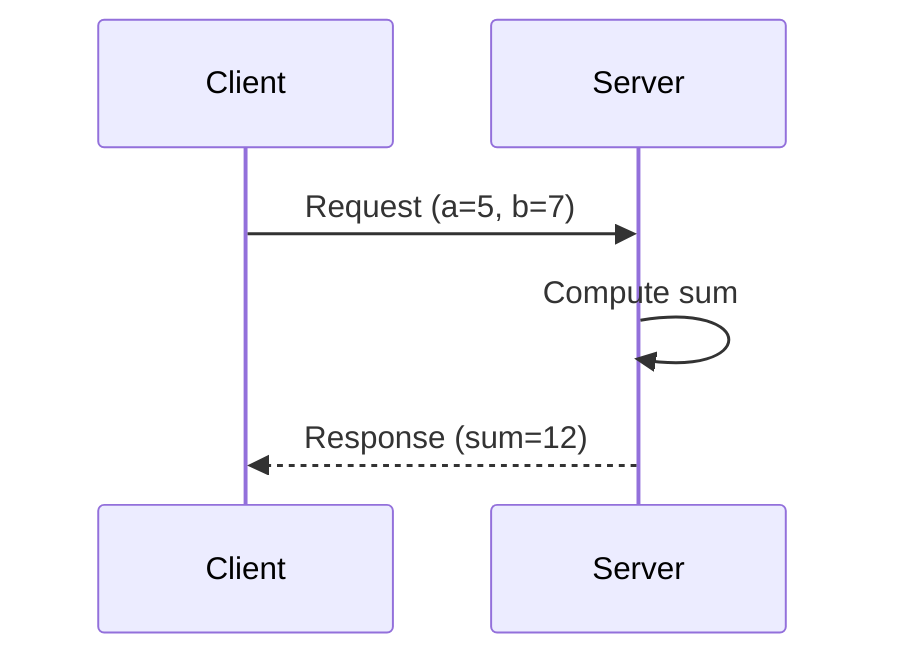

# Data Model: Module 1 Content Structure

**Date**: 2025-12-09 | **Feature**: 001-ros2-robotic-nervous-system | **Phase**: 1

## Chapter Template Schema

### MDX Frontmatter

```yaml
---
id: chapter-identifier           # Unique ID (e.g., "nodes-and-topics")
title: Chapter Display Title     # Sidebar and page title
sidebar_label: Short Label       # Optional shorter sidebar label
sidebar_position: 1              # Numeric order in sidebar
description: SEO meta description
keywords: [ros2, nodes, topics]  # SEO keywords
---
```

### Content Sections (Required Order)

1. **Introduction** (H2: `## Introduction`)
   - Brief chapter overview (2-3 sentences)
   - Motivation: Why this topic matters for robotics

2. **Prerequisites** (H2: `## Prerequisites`)
   - Admonition block: `:::note Prerequisites`
   - System requirements (OS, ROS 2 version, Python version)
   - Required packages (with install commands)
   - Prior knowledge (e.g., "Completed Chapter 1")

3. **Learning Objectives** (H2: `## Learning Objectives`)
   - Bulleted list of 3-5 measurable outcomes
   - Format: "By the end of this chapter, you will be able to..."
   - Examples:
     - "Create a ROS 2 publisher node in Python"
     - "Explain the difference between RELIABLE and BEST_EFFORT QoS"
     - "Debug topic communication using ros2 CLI tools"

4. **Concept Explanation** (H2: `## [Concept Name]`)
   - Main technical content (multiple H2/H3 sections as needed)
   - Definitions, diagrams, comparisons
   - Real-world analogies for beginners

5. **Code Examples** (H2 or H3 depending on structure)
   - **For each example**:
     - **Explanation** (paragraph): What this code does and why
     - **Full code block**: Complete, runnable code
     - **Execution instructions**: Terminal commands to run
     - **Expected output**: What student should see
     - **Key line breakdown**: Explanation of 3-5 important lines
   - Use pattern: `### Example 1: Minimal Publisher`

6. **Exercises** (H2: `## Exercises`)
   - 3 exercises per chapter (Basic, Intermediate, Advanced)
   - **Each exercise** (`### Exercise 1: [Title]`):
     - **Objective**: 1 sentence goal
     - **Instructions**: Numbered steps
     - **Verification**: How to check correctness
     - **Solution**: Collapsible `<details>` with code and explanation

7. **Common Errors** (H2: `## Common Errors`)
   - 4-5 typical mistakes beginners make
   - **Format**: `### Error: [Error Message or Symptom]`
     - **Symptom**: What student sees (error message, unexpected behavior)
     - **Cause**: Why this happens
     - **Solution**: How to fix
   - Example: `### Error: Context must be initialized`

8. **Summary** (H2: `## Summary`)
   - 3-5 bullet points recapping key concepts
   - Link to next chapter (if applicable)

9. **References** (H2: `## References`)
   - IEEE-format bibliography (minimum 5 citations)
   - Links to official documentation, tutorials, source code

---

## Code Example Template

### Structure

```mdx
### Example [N]: [Title]

[2-3 sentence explanation of what this example demonstrates and its real-world use case]

```python title="[filename].py" showLineNumbers
#!/usr/bin/env python3
"""
Docstring explaining the module.

Author: [Author Name]
License: MIT
"""

import rclpy
from rclpy.node import Node
from std_msgs.msg import String


class [ClassName](Node):
    """
    Brief class description.
    """

    def __init__(self):
        super().__init__('node_name')
        # Initialization code

    def callback_method(self):
        """Callback docstring."""
        # Callback logic
        pass


def main(args=None):
    rclpy.init(args=args)
    node = [ClassName]()
    rclpy.spin(node)
    node.destroy_node()
    rclpy.shutdown()


if __name__ == '__main__':
    main()
```

**Running the example:**

```bash
# Terminal 1: Run the node
ros2 run package_name node_name
```

**Expected output:**

```
[INFO] [timestamp] [node_name]: Publishing: "Hello, ROS 2!"
```

**Key lines explained:**

- **Line X**: [Explanation of why this line is important]
- **Line Y**: [Explanation]
- **Line Z**: [Explanation]

[Optional: Link to full code in GitHub repository]
```

### Validation Checklist (Applied Before Embedding)

- [ ] Code runs without errors in ROS 2 Humble (Ubuntu 22.04, Python 3.10)
- [ ] All imports present (no missing `import` statements)
- [ ] Includes `main()` function with proper `rclpy.init()` and `shutdown()`
- [ ] Class and key methods have docstrings
- [ ] Follows PEP 8 style (checked with `black --check` and `flake8`)
- [ ] No hardcoded values (use parameters or clearly explain magic numbers)
- [ ] Inline comments explain WHY, not WHAT (per constitution)
- [ ] Output matches documented "Expected output"

---

## Exercise Template

```mdx
### Exercise [N]: [Title] ([Difficulty Level])

**Objective**: [One sentence goal, e.g., "Modify the publisher to send sensor data at 2Hz instead of 1Hz."]

**Instructions**:

1. [Step 1 with specific action, e.g., "Open `publisher_example.py`"]
2. [Step 2, e.g., "Locate line 15 where `create_timer` is called"]
3. [Step 3, e.g., "Change the timer period from `1.0` to `0.5` seconds"]
4. [Step 4, e.g., "Save the file and run the publisher"]

**Verification**: [How student knows they succeeded, e.g., "Run `ros2 topic hz /topic_name` and verify it reports ~2 Hz."]

<details>
<summary>Solution</summary>

**Modified code** (line 15):

```python
self.timer = self.create_timer(0.5, self.timer_callback)  # 0.5s = 2Hz
```

**Explanation**: The `create_timer` method takes the period in seconds. To achieve 2 Hz (2 messages per second), we use `1/2 = 0.5` seconds.

**Full verification steps**:

```bash
# Terminal 1
ros2 run module1_examples publisher

# Terminal 2
ros2 topic hz /sensor_data
# Should show: average rate: 2.0
```

</details>
```

### Difficulty Levels

- **Basic**: Modify a single value (variable, string, parameter)
- **Intermediate**: Add a feature (new publisher, service call, URDF link)
- **Advanced**: Combine concepts (multi-node system, error handling, custom logic)

---

## Diagram Conventions

### SVG Diagram Standards

**Tool Recommendations**:
- **draw.io** (diagrams.net): Free, exports clean SVG, supports layers
- **Inkscape**: Vector editing, precise control
- **Figma**: Collaborative, web-based (exports SVG)

**Style Guidelines**:

1. **Color Palette** (consistent across all diagrams):
   - **Nodes/Processes**: Blue (#3498db)
   - **Topics/Data**: Orange (#e67e22)
   - **Actions/Operations**: Green (#27ae60)
   - **Errors/Warnings**: Red (#e74c3c)
   - **Background**: White (#ffffff)
   - **Text**: Dark gray (#2c3e50)

2. **Shapes**:
   - **Processes (nodes, executors)**: Rectangles with rounded corners
   - **Data (topics, messages)**: Parallelograms or cylinders
   - **Actions (publish, subscribe)**: Arrows with labels
   - **Coordinate frames (URDF)**: Axes (X=red, Y=green, Z=blue, robotics convention)

3. **Typography**:
   - **Font**: Arial or Roboto (web-safe, clean)
   - **Label size**: 14pt (readable at 100% zoom)
   - **Annotations**: 12pt
   - **Code snippets in diagrams**: Monospace font (Courier New)

4. **Dimensions**:
   - **Width**: 600-800px (responsive, not too wide)
   - **Height**: Auto (maintain aspect ratio)
   - **Export**: SVG with embedded fonts (no external dependencies)

5. **Accessibility**:
   - **Alt text**: Descriptive alt attribute in MDX (``)
   - **High contrast**: Ensure text readable on background (WCAG AA)
   - **No color-only differentiation**: Use shapes + colors (e.g., dashed lines for errors)

### Mermaid Diagram Syntax (Simple Flowcharts)

**Service Request-Response Sequence**:



**Topic Publish-Subscribe Flow**:


**Decision**: Use Mermaid for simple sequences/flowcharts; SVG for complex diagrams (URDF trees, coordinate frames).

---

## Metadata Fields (Frontmatter Extensions)

### Optional Tracking Fields (Not Required, Future Analytics)

```yaml
---
# ... standard frontmatter ...
estimated_time: 60    # Minutes to complete chapter
difficulty: beginner  # beginner | intermediate | advanced
word_count: 2500      # Auto-generated or manual
code_examples: 4      # Number of runnable examples
exercises: 3          # Number of exercises
citations: 5          # Number of IEEE references
last_updated: 2025-12-09
---
```

**Use Case**: Future analytics dashboard showing module completion stats, estimated time accuracy.

---

## Content Length Targets

| Chapter | Word Count | Code Examples | Diagrams | Exercises | Citations |
|---------|-----------|---------------|----------|-----------|-----------|
| Chapter 1: Nodes & Topics | 2500-3000 | 4 | 2 SVG | 3 | ≥5 |
| Chapter 2: Services | 2000-2500 | 4 | 1 SVG or Mermaid | 3 | ≥5 |
| Chapter 3: URDF | 2500-3000 | 3 (XML) | 2 SVG | 3 | ≥5 |

**Total Module 1**: ~7500-8500 words, 11 examples, 5 diagrams, 9 exercises, ≥15 citations

---

## File Naming Conventions

### MDX Files
- Format: `[number]-[slug].mdx`
- Examples:
  - `01-nodes-and-topics.mdx`
  - `02-services.mdx`
  - `03-urdf-basics.mdx`

### Assets
- Format: `[chapter]-[description].svg`
- Examples:
  - `ch1-node-architecture.svg`
  - `ch1-topic-pubsub-flow.svg`
  - `ch2-service-sequence.svg`
  - `ch3-urdf-link-tree.svg`
  - `ch3-coordinate-frames.svg`

### Code Files (Validation Workspace)
- Format: `[descriptor]_example.py`
- Examples:
  - `publisher_example.py`
  - `subscriber_example.py`
  - `service_server.py`
  - `service_client.py`
- URDF: `simple_humanoid.urdf`, `humanoid_with_hands.urdf`

---

## Validation Schema

### Chapter Completeness Checklist

When reviewing a chapter MDX file, verify:

- [ ] Frontmatter present with all required fields (id, title, sidebar_position, description)
- [ ] All 9 sections present (Intro, Prerequisites, Objectives, Concept, Examples, Exercises, Errors, Summary, References)
- [ ] Word count within target range (±10%)
- [ ] Code example count matches contract (±1)
- [ ] Diagram count matches contract
- [ ] Exercise count = 3 (Basic, Intermediate, Advanced)
- [ ] Common Errors section has 4-5 examples
- [ ] References section has ≥5 IEEE citations
- [ ] All code blocks have language tags (` ```python `, ` ```bash `, ` ```xml `)
- [ ] All images have alt text
- [ ] All internal links valid (no broken cross-references)
- [ ] Docusaurus build succeeds (`npm run build`)

---

## Next Steps

1. Use this data model when creating chapter content contracts (contracts/ directory)
2. Apply templates during implementation phase
3. Validate each chapter against schema before PR review
