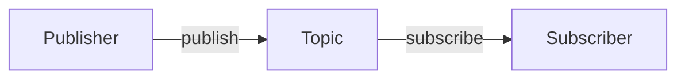

# Quickstart: Module 1 Development Workflow

**Date**: 2025-12-09 | **Feature**: 001-ros2-robotic-nervous-system

## Overview

This guide documents the complete workflow for creating Module 1 chapters: from setup through code validation, content writing, quality checks, and final merge.

---

## 1. Initial Setup

### Prerequisites

Ensure you have:
- Git installed and repository cloned
- Node.js v18+ installed (`node --version`)
- ROS 2 Humble sourced (`source /opt/ros/humble/setup.bash`)
- Python 3.10+ (`python3 --version`)
- Text editor (VS Code recommended)

### Repository Setup

```bash
# Clone repository
git clone <repository-url>
cd Humain-robotic-ai-book

# Install Docusaurus dependencies
cd Humain-robotic-book
npm install

# Verify Docusaurus works
npm run start
# Should open browser at http://localhost:3000
```

### ROS 2 Workspace Setup

```bash
# Create code validation workspace (separate from book content)
mkdir -p ~/ros2_code_examples/src
cd ~/ros2_code_examples

# Create Module 1 example package
cd src
ros2 pkg create --build-type ament_python module1_examples

# Build workspace
cd ~/ros2_code_examples
colcon build
source install/setup.bash
```

---

## 2. Writing Workflow (Per Chapter)

### Step 1: Create Feature Branch

```bash
# From repository root
git checkout 001-ros2-robotic-nervous-system

# Create chapter branch
git checkout -b 001-ros2-robotic-nervous-system/chapter-1
```

### Step 2: Read Chapter Contract

- Open `specs/001-ros2-robotic-nervous-system/contracts/chapter-[N]-[name].md`
- Review: word count target, code example count, diagram count, exercise count
- Note: specific functional requirements (FR-XXX) to validate

### Step 3: Create MDX File

```bash
# Create chapter file
cd Humain-robotic-book/docs
mkdir -p module-1-ros2
cd module-1-ros2
touch 01-nodes-and-topics.mdx  # Or 02-services.mdx, 03-urdf.mdx
```

### Step 4: Add Frontmatter

```mdx
---
id: nodes-and-topics
title: "Chapter 1: ROS 2 Nodes and Topic Communication"
sidebar_label: "Ch1: Nodes & Topics"
sidebar_position: 1
description: Learn how ROS 2 nodes communicate using topics for asynchronous message passing in robotic systems.
keywords: [ros2, nodes, topics, publisher, subscriber, rclpy]
---
```

### Step 5: Follow Content Template

Use structure from `specs/001-ros2-robotic-nervous-system/data-model.md`:

1. Introduction (2-3 sentences)
2. Prerequisites (admonition block)
3. Learning Objectives (bulleted list)
4. Concept Explanation (main content with H2/H3 sections)
5. Code Examples (4 for Ch1/Ch2, 3 for Ch3)
6. Exercises (3 total: Basic, Intermediate, Advanced)
7. Common Errors (4-5 examples)
8. Summary (bullet points)
9. References (IEEE format, minimum 5)

### Step 6: Write Code Examples in Validation Workspace FIRST

**DO NOT embed code in MDX until validated!**

```bash
# Navigate to ROS 2 workspace
cd ~/ros2_code_examples/src/module1_examples/module1_examples

# Create Python file
nano publisher_example.py

# Write code following template from data-model.md
# Include: full imports, docstrings, main() function

# Add entry point to setup.py
nano ../setup.py
# Add to entry_points:
#   'console_scripts': [
#     'publisher = module1_examples.publisher_example:main',
#   ],
```

### Step 7: Test Code Example

```bash
# Build package
cd ~/ros2_code_examples
colcon build --packages-select module1_examples
source install/setup.bash

# Run example
ros2 run module1_examples publisher

# Verify output matches expected behavior
# Test edge cases from "Common Errors" section
```

### Step 8: Validate Code Quality

```bash
# Check PEP 8 compliance
cd ~/ros2_code_examples/src/module1_examples
black --check module1_examples/publisher_example.py
flake8 module1_examples/publisher_example.py

# Auto-format if needed
black module1_examples/publisher_example.py
```

### Step 9: Copy Validated Code to MDX

```mdx
### Example 1: Minimal Publisher

This example creates a ROS 2 node that publishes string messages to a topic every second.

```python title="publisher_example.py" showLineNumbers
#!/usr/bin/env python3
"""
Minimal ROS 2 publisher example.
"""

import rclpy
from rclpy.node import Node
from std_msgs.msg import String

# ... (copy EXACT code from validated file)
```

**Running the example:**

```bash
ros2 run module1_examples publisher
```

**Expected output:**

```
[INFO] [timestamp] [minimal_publisher]: Publishing: "Hello, ROS 2!"
```
```

### Step 10: Create Diagrams

**For SVG diagrams:**

1. Use draw.io (https://app.diagrams.net/)
2. Create diagram following style guide (data-model.md § Diagram Conventions)
3. Export as SVG with embedded fonts
4. Save to `Humain-robotic-book/docs/module-1-ros2/assets/ch1-node-architecture.svg`
5. Reference in MDX: ``

**For Mermaid diagrams:**

```mdx

```

### Step 11: Write Exercises with Solutions

```mdx
### Exercise 1: Modify Publisher Message (Basic)

**Objective**: Change the message content to "Hello from Student!"

**Instructions**:
1. Open `publisher_example.py`
2. Locate line 15: `msg.data = "Hello, ROS 2!"`
3. Change to: `msg.data = "Hello from Student!"`
4. Save and run: `ros2 run module1_examples publisher`

**Verification**: Run `ros2 topic echo /sensor_data` and confirm new message appears.

<details>
<summary>Solution</summary>

**Changed line 15**:
```python
msg.data = "Hello from Student!"
```

**Explanation**: The `msg.data` field holds the string content. We simply replace the string literal.

</details>
```

### Step 12: Add IEEE Citations

At end of chapter:

```mdx
## References

[ROS2Docs2023] Open Robotics, "ROS 2 Documentation: Humble Hawksbill," docs.ros.org, https://docs.ros.org/en/humble/, 2023.

[rclpy2023] Open Robotics, "rclpy - ROS Client Library for Python," GitHub, https://github.com/ros2/rclpy, 2023.

[ROS2Concepts2023] Open Robotics, "ROS 2 Concepts: Nodes," docs.ros.org, https://docs.ros.org/en/humble/Concepts/About-Nodes.html, 2023.

[QoSGuide2023] Open Robotics, "About Quality of Service Settings," docs.ros.org, https://docs.ros.org/en/humble/Concepts/About-Quality-of-Service-Settings.html, 2023.

[DDS2015] Object Management Group, "Data Distribution Service (DDS) Version 1.4," OMG Specification, https://www.omg.org/spec/DDS/, 2015.
```

Inline citation usage:
```mdx
ROS 2 uses the DDS middleware for inter-node communication [ROS2Docs2023].
```

---

## 3. Local Testing

### Preview in Browser

```bash
cd Humain-robotic-book
npm run start

# Browser opens at http://localhost:3000
# Navigate to Module 1 → Chapter 1
# Verify:
# - All formatting correct
# - Code blocks have syntax highlighting
# - Diagrams load
# - Links work
# - Exercises collapsible sections work
```

### Build Test

```bash
npm run build

# Should complete in <2 minutes (constitution requirement)
# Check output: build/ directory created
# No errors or broken links
```

### Link Checker (Optional)

```bash
# Install link checker
npm install -g linkinator

# Check for broken links
cd Humain-robotic-book/build
npx linkinator . --recurse --skip "localhost"
```

---

## 4. Quality Checks

### Pre-Commit Checklist

Run through this checklist before committing:

- [ ] **Word count**: Within target range (use `wc -w 01-nodes-and-topics.mdx`)
- [ ] **Code examples**: All tested in ROS 2 workspace, output matches docs
- [ ] **Code quality**: `black --check` and `flake8` pass
- [ ] **Diagrams**: All images load, alt text present
- [ ] **Exercises**: 3 total (Basic, Intermediate, Advanced) with solutions
- [ ] **Common Errors**: 4-5 examples with symptom/cause/solution
- [ ] **Citations**: Count `[XYZ20XX]` refs, ensure ≥5
- [ ] **Docusaurus build**: `npm run build` succeeds
- [ ] **No broken links**: Manual check or linkinator
- [ ] **Frontmatter**: All required fields (id, title, sidebar_position)
- [ ] **Functional requirements**: Validate against chapter contract (FR-XXX)

### Automated Validation Script (Future Enhancement)

```bash
# Example validation script (create in scripts/validate-chapter.sh)
#!/bin/bash
CHAPTER=$1

# Word count check
WORDS=$(pandoc -f markdown -t plain docs/module-1-ros2/$CHAPTER.mdx | wc -w)
echo "Word count: $WORDS"

# Citation count
CITATIONS=$(grep -o '\[.*20[0-9][0-9]\]' docs/module-1-ros2/$CHAPTER.mdx | sort -u | wc -l)
echo "Citations: $CITATIONS (target: ≥5)"

# Code block language tags
UNTAGGED=$(grep -E '^```$' docs/module-1-ros2/$CHAPTER.mdx | wc -l)
if [ $UNTAGGED -gt 0 ]; then
  echo "WARNING: $UNTAGGED code blocks without language tags"
fi

# Build test
npm run build
```

---

## 5. Commit and Pull Request

### Commit Changes

```bash
# Stage files
git add Humain-robotic-book/docs/module-1-ros2/01-nodes-and-topics.mdx
git add Humain-robotic-book/docs/module-1-ros2/assets/*.svg

# Commit with descriptive message
git commit -m "feat(module1): Add Chapter 1 - ROS 2 Nodes and Topics

- Implemented 4 code examples (publisher, subscriber, QoS demo)
- Created 2 diagrams (node architecture, pub-sub flow)
- Added 3 exercises with solutions
- Included 5 IEEE citations
- Validates FR-001 through FR-009, SC-001

Tested on ROS 2 Humble (Ubuntu 22.04, Python 3.10)"
```

### Push and Create PR

```bash
# Push branch
git push origin 001-ros2-robotic-nervous-system/chapter-1

# Create PR on GitHub (or use gh CLI)
gh pr create --title "Chapter 1: ROS 2 Nodes and Topics" \
  --body "Implements User Story 1 (P1)

**Checklist**:
- [x] Word count: 2750 words (target: 2500-3000)
- [x] Code examples: 4 (all tested)
- [x] Diagrams: 2 SVG
- [x] Exercises: 3 (Basic, Intermediate, Advanced)
- [x] Common Errors: 5 examples
- [x] Citations: 6 IEEE refs
- [x] Docusaurus build: ✅ (1m 32s)
- [x] PEP 8: ✅
- [x] Validates: FR-001 to FR-009, SC-001

**Review Notes**: Chapter ready for technical review."
```

---

## 6. Review Process

### Self-Review

Before requesting review:
1. Re-read entire chapter for clarity and flow
2. Verify all code examples run (re-test from scratch)
3. Check grammar and spelling (Grammarly, VS Code spell checker)
4. Ensure technical accuracy against ROS 2 docs

### Peer Review (Technical Expert)

Reviewer checks:
- [ ] **Technical accuracy**: Code examples match ROS 2 Humble API
- [ ] **Citations valid**: Links work, references accurate
- [ ] **Runnable code**: Reviewer runs all examples, confirms output
- [ ] **Clarity**: Explanations understandable for beginner/intermediate students
- [ ] **Constitution compliance**: Adheres to technical accuracy, reproducibility, citations

### CI Checks (Automated)

GitHub Actions should run:
- `npm run build` (Docusaurus build)
- Link checker
- (Future) ROS 2 code validation in Docker container

---

## 7. Merge and Integration

### After Approval

```bash
# Merge chapter PR to feature branch
git checkout 001-ros2-robotic-nervous-system
git merge 001-ros2-robotic-nervous-system/chapter-1
git push origin 001-ros2-robotic-nervous-system

# Repeat for Chapter 2 and Chapter 3
```

### Final Module PR (After All Chapters Complete)

```bash
# Create PR from feature branch to main
gh pr create --base main \
  --title "Module 1: ROS 2 Robotic Nervous System" \
  --body "Complete implementation of Module 1 with 3 chapters.

**Contents**:
- Chapter 1: Nodes & Topics (2750 words, 4 examples)
- Chapter 2: Services (2300 words, 4 examples)
- Chapter 3: URDF Basics (2850 words, 3 examples)

**Total**: ~7900 words, 11 code examples, 5 diagrams, 9 exercises, 16 citations

**Success Criteria Validated**:
- SC-001 to SC-010 (all pass)
- Constitution compliance: ✅

**Deploy**: Ready for GitHub Pages deployment."
```

---

## 8. Post-Merge Deployment

### GitHub Pages Deployment

```bash
# Deployment handled by GitHub Actions (automated)
# Verify at: https://<username>.github.io/<repo-name>/

# Manual deployment (if needed):
cd Humain-robotic-book
npm run build
npm run deploy
```

### Verification

1. Visit deployed site
2. Navigate to Module 1
3. Test all code examples from book instructions
4. Verify diagrams load
5. Check mobile responsiveness
6. Test on 3G connection (performance)

---

## 9. Troubleshooting

### Docusaurus Build Fails

**Error**: "Error: Duplicate routes found"

**Solution**: Check `sidebar_position` values are unique, no duplicate file names

**Error**: "Broken link: /docs/some-page"

**Solution**: Verify all internal links use correct paths, check for typos

### Code Examples Don't Run

**Error**: `ModuleNotFoundError: No module named 'rclpy'`

**Solution**: Source ROS 2 environment: `source /opt/ros/humble/setup.bash`

**Error**: `ros2: command not found`

**Solution**: Install ROS 2 Humble, add to `.bashrc`: `source /opt/ros/humble/setup.bash`

### Diagrams Not Loading

**Solution**: Verify file path relative to MDX file, check case sensitivity (Linux), ensure SVG exported correctly

---

## 10. Tips and Best Practices

### Writing Tips

- **Keep beginner students in mind**: Explain jargon, provide context
- **Use active voice**: "Create a publisher" not "A publisher is created"
- **Show, don't just tell**: Code examples before theory
- **Iterate**: First draft doesn't need to be perfect, revise after testing

### Code Quality

- **Test edge cases**: What happens if node crashes? Service times out?
- **Comment WHY, not WHAT**: `# Init ROS 2 before node creation` not `# Call init`
- **Full examples**: Students should copy-paste and run, no "fill in the blanks"

### Efficiency

- **Batch diagram creation**: Create all diagrams for a chapter at once
- **Reuse patterns**: Copy-paste exercise template, customize content
- **Use snippets**: Create VS Code snippets for common patterns (admonitions, code blocks)

---

## 11. Reference Links

- **Docusaurus Docs**: https://docusaurus.io/docs
- **ROS 2 Humble Docs**: https://docs.ros.org/en/humble/
- **MDX Syntax**: https://mdxjs.com/
- **IEEE Citation Format**: https://ieee-dataport.org/sites/default/files/analysis/27/IEEE%20Citation%20Guidelines.pdf
- **PEP 8 Style Guide**: https://peps.python.org/pep-0008/

---

## Summary Workflow Diagram

```
[Create Branch] → [Read Contract] → [Create MDX] → [Add Frontmatter] →
[Write Content] → [Develop Code in ROS 2 Workspace] → [Test Code] →
[Validate PEP 8] → [Copy Code to MDX] → [Create Diagrams] →
[Write Exercises] → [Add Citations] → [Local Preview] →
[Run Build Test] → [Quality Checklist] → [Commit] → [Push] →
[Create PR] → [Self-Review] → [Peer Review] → [CI Checks] →
[Merge] → [Deploy] → [Verify Live Site]
```

**Estimated Time per Chapter**: 12-16 hours (development + testing + review)

---

**Next Steps**: Use this workflow to implement Chapter 1, then iterate for Chapters 2 and 3.
