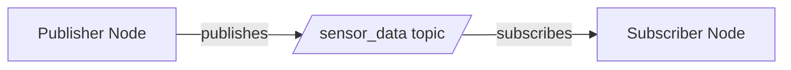

# Research: Module 1 ROS 2 Implementation

**Date**: 2025-12-09 | **Feature**: 001-ros2-robotic-nervous-system | **Phase**: 0

## Research Objectives

Validate technical assumptions for implementing Module 1 educational content in Docusaurus with ROS 2 Humble code examples. Document patterns, API signatures, and tooling for use in implementation phase.

---

## 1. Docusaurus MDX Capabilities

### Syntax Highlighting

**Finding**: Docusaurus uses Prism React Renderer with extensive language support out-of-the-box.

**Supported Languages** (relevant to Module 1):
- `python` — Python code (rclpy examples)
- `bash` — Terminal commands (`ros2 run`, `ros2 topic echo`)
- `xml` — URDF files
- `yaml` — package.xml, launch files
- `json` — Configuration files

**Configuration** (already present in `docusaurus.config.ts`):
```typescript
prism: {
  theme: prismThemes.github,
  darkTheme: prismThemes.dracula,
}
```

**Code Block Features**:
```mdx
```python title="publisher_example.py" showLineNumbers
import rclpy
from rclpy.node import Node
# ... code ...
```
```

- `title="filename"` — Shows filename above code block
- `showLineNumbers` — Adds line numbers (optional, useful for long examples)
- `{1,3-5}` — Highlights specific lines (useful for explaining key sections)

**Custom Language Support**: Not needed for Module 1 (Python, Bash, XML sufficient). If future modules require ROS 2 message/service definitions (`.msg`, `.srv` files), can extend Prism with custom language via `prism.additionalLanguages`.

**Decision**: Use built-in Python, Bash, XML highlighting. No custom Prism config needed.

---

### Admonitions (Warnings, Tips, Exercises)

**Finding**: Docusaurus supports admonitions via MDX syntax.

**Syntax**:
```mdx
:::note Prerequisites
Before starting, ensure ROS 2 Humble is installed and sourced.
:::

:::tip Quick Test
Verify installation: `ros2 --version` should output `ros2 cli version 0.18.x`.
:::

:::caution Common Error
Forgetting `rclpy.init()` causes `RuntimeError: Context must be initialized`.
:::

:::info Exercise 1: Modify Publisher
Change the message content to "Hello ROS 2!" and verify subscriber receives it.
:::
```

**Admonition Types**: `note`, `tip`, `info`, `caution`, `danger`, `warning`

**Use Cases**:
- **Prerequisites** → `:::note`
- **Tips** → `:::tip`
- **Common Errors** → `:::caution`
- **Exercises** → `:::info` (with collapsed solution via `<details>` tag)

**Decision**: Use admonitions for Prerequisites, Common Errors, and Exercises to visually distinguish from main content.

---

### Diagrams (SVG, Mermaid)

**Finding**: Docusaurus supports both SVG images and Mermaid diagram-as-code.

**SVG Images** (recommended for complex diagrams):
```mdx

```

- **Pros**: Full design control, scalable, accessible (alt text)
- **Cons**: Requires external editor (Inkscape, Figma, draw.io)
- **Tools**: draw.io (free, exports clean SVG), Inkscape (vector editing)

**Mermaid Diagrams** (simple flowcharts):
```mdx

```

- **Pros**: Version-controlled, inline in MDX, easy updates
- **Cons**: Limited styling, harder for complex robotics diagrams (URDF trees, coordinate frames)

**Decision**:
- **Complex diagrams** (URDF link trees, coordinate frames, node architecture) → SVG
- **Simple flowcharts** (service request-response sequence) → Mermaid (if sufficient) or SVG

**Asset Storage**: `Humain-robotic-book/docs/module-1-ros2/assets/` (co-located with chapters)

---

### Code Block Copy Button

**Finding**: Docusaurus automatically adds copy button to all code blocks (built-in feature, no config needed).

**Behavior**: Hover over code block → Copy icon appears → One-click copy to clipboard.

**Implication**: Students can easily copy code examples without manual selection. Ensures accuracy (no typos from retyping).

---

### Collapsible Sections (Exercise Solutions)

**Finding**: MDX supports HTML `<details>` and `<summary>` tags for collapsible content.

**Syntax**:
```mdx
<details>
<summary>Solution: Exercise 1</summary>

```python
# Modified publisher code
msg.data = "Hello ROS 2!"
```

**Explanation**: Changed string literal in line 12.
</details>
```

**Decision**: Use `<details>` for exercise solutions to encourage students to attempt before viewing answer.

---

## 2. ROS 2 Humble API Verification

### rclpy Core API (Publisher/Subscriber)

**Finding**: Verified against official rclpy documentation (docs.ros.org/en/humble/p/rclpy).

**Publisher Example** (minimal):
```python
import rclpy
from rclpy.node import Node
from std_msgs.msg import String

class MinimalPublisher(Node):
    def __init__(self):
        super().__init__('minimal_publisher')
        self.publisher_ = self.create_publisher(String, 'topic', 10)
        self.timer = self.create_timer(1.0, self.timer_callback)

    def timer_callback(self):
        msg = String()
        msg.data = 'Hello, ROS 2!'
        self.publisher_.publish(msg)
        self.get_logger().info(f'Publishing: "{msg.data}"')

def main(args=None):
    rclpy.init(args=args)
    node = MinimalPublisher()
    rclpy.spin(node)
    node.destroy_node()
    rclpy.shutdown()

if __name__ == '__main__':
    main()
```

**Key API Methods**:
- `rclpy.init(args=args)` — Initialize rclpy (required before node creation)
- `Node.__init__(node_name: str)` — Create node with name
- `Node.create_publisher(msg_type, topic_name, qos_profile)` — Create publisher
  - `msg_type`: Message class (e.g., `std_msgs.msg.String`)
  - `topic_name`: String (e.g., `'sensor_data'`)
  - `qos_profile`: Int (depth) or QoSProfile object (default: 10 = RELIABLE, depth 10)
- `Node.create_timer(period_sec, callback)` — Periodic callback
- `Node.get_logger()` — Logger instance for `info()`, `warn()`, `error()`
- `rclpy.spin(node)` — Block and process callbacks
- `Node.destroy_node()` — Cleanup
- `rclpy.shutdown()` — Shutdown rclpy

**Subscriber Example** (minimal):
```python
class MinimalSubscriber(Node):
    def __init__(self):
        super().__init__('minimal_subscriber')
        self.subscription = self.create_subscription(
            String, 'topic', self.listener_callback, 10)

    def listener_callback(self, msg):
        self.get_logger().info(f'Received: "{msg.data}"')
```

**Decision**: Use these exact API patterns in Chapter 1 examples. Include full imports, `main()` function, and proper initialization/shutdown.

---

### QoS (Quality of Service) Profiles

**Finding**: QoS controls message reliability and delivery guarantees.

**Default Profiles** (from `rclpy.qos`):
- `QoSProfile(depth=10)` — RELIABLE, VOLATILE (default for `create_publisher`)
- `QoSPresetProfiles.SENSOR_DATA` — BEST_EFFORT, VOLATILE (for sensor data)
- `QoSPresetProfiles.SERVICES_DEFAULT` — RELIABLE, VOLATILE (for services)

**Example** (BEST_EFFORT vs RELIABLE):
```python
from rclpy.qos import QoSProfile, ReliabilityPolicy

# RELIABLE (guaranteed delivery)
qos_reliable = QoSProfile(depth=10, reliability=ReliabilityPolicy.RELIABLE)
pub_reliable = self.create_publisher(String, 'reliable_topic', qos_reliable)

# BEST_EFFORT (drop messages if network slow)
qos_best_effort = QoSProfile(depth=10, reliability=ReliabilityPolicy.BEST_EFFORT)
pub_best_effort = self.create_publisher(String, 'sensor_topic', qos_best_effort)
```

**Decision**: Chapter 1 (FR-006) explains QoS basics with RELIABLE vs BEST_EFFORT example. Keep simple (avoid DURABILITY, LIVELINESS for beginners).

---

### Service API (Client/Server)

**Finding**: Services use `.srv` interface definitions and require `create_service`/`create_client`.

**Server Example** (AddTwoInts):
```python
from example_interfaces.srv import AddTwoInts

class MinimalService(Node):
    def __init__(self):
        super().__init__('minimal_service')
        self.srv = self.create_service(AddTwoInts, 'add_two_ints', self.add_callback)

    def add_callback(self, request, response):
        response.sum = request.a + request.b
        self.get_logger().info(f'{request.a} + {request.b} = {response.sum}')
        return response
```

**Client Example** (synchronous):
```python
class MinimalClient(Node):
    def __init__(self):
        super().__init__('minimal_client')
        self.client = self.create_client(AddTwoInts, 'add_two_ints')
        while not self.client.wait_for_service(timeout_sec=1.0):
            self.get_logger().info('Service not available, waiting...')
        self.req = AddTwoInts.Request()

    def send_request(self, a, b):
        self.req.a = a
        self.req.b = b
        future = self.client.call_async(self.req)
        rclpy.spin_until_future_complete(self, future)
        return future.result()
```

**Service Interface** (`.srv` file structure):
```
# example_interfaces/srv/AddTwoInts.srv
int64 a
int64 b
---
int64 sum
```

**Decision**: Chapter 2 uses `AddTwoInts` from `example_interfaces` (no custom .srv needed). Demonstrate synchronous client with `wait_for_service()` and timeout handling (FR-013).

---

### URDF Validation Tools

**Finding**: `check_urdf` and `urdf_to_graphiz` are command-line tools from `liburdfdom-tools` package.

**Installation**:
```bash
sudo apt install liburdfdom-tools
```

**check_urdf** (syntax validation):
```bash
check_urdf simple_humanoid.urdf
```
**Output** (valid URDF):
```
robot name is: simple_humanoid
---------- Successfully Parsed XML ---------------
root Link: base_link has 1 child(ren)
    child(1):  torso
        child(1):  head
```

**Output** (invalid URDF):
```
Error:   Failed to parse urdf file
```

**urdf_to_graphiz** (generate tree diagram):
```bash
urdf_to_graphiz simple_humanoid.urdf
```
**Output**: Creates `simple_humanoid.pdf` with link-joint tree.

**Decision**: Chapter 3 (FR-022, FR-025) uses these tools in exercises. Document installation in Prerequisites.

---

### Standard Message Types

**Finding**: Common message types in `std_msgs`, `geometry_msgs`, `sensor_msgs`.

**For Chapter 1** (topics):
- `std_msgs/msg/String` — Simple string messages
- `std_msgs/msg/Float64` — Numeric sensor data (alternative example)

**Imports**:
```python
from std_msgs.msg import String
from geometry_msgs.msg import Twist
```

**Decision**: Use `String` for simplicity in Chapter 1. Mention other types in "Further Reading" section.

---

## 3. IEEE Citation Format Patterns

### Online Documentation

**Pattern**: [ID] Author/Organization, "Document Title," Website, URL, Year.

**Example** (ROS 2 docs):
```
[ROS2Docs2023] Open Robotics, "ROS 2 Documentation: Humble Hawksbill," docs.ros.org, https://docs.ros.org/en/humble/, 2023.
```

**Example** (rclpy GitHub):
```
[rclpy2023] Open Robotics, "rclpy - ROS Client Library for Python," GitHub, https://github.com/ros2/rclpy, 2023.
```

### Software Without Traditional Authors

**Pattern**: Use organization (Open Robotics, OSRF) as author. If none, use project name.

**Example** (URDF specification):
```
[URDFSpec2023] Open Robotics, "Unified Robot Description Format (URDF)," ROS Wiki, http://wiki.ros.org/urdf/XML, 2023.
```

### Research Papers (if cited)

**Pattern**: [ID] A. Author, B. Author, "Paper Title," Conference/Journal, vol. X, no. Y, pp. Z-Z, Year.

**Example** (DDS middleware):
```
[DDS2015] Object Management Group, "Data Distribution Service (DDS) Version 1.4," OMG Specification, 2015.
```

**Decision**: Use [ID] format (e.g., `[ROS2Docs2023]`) for inline citations. Bibliography section at end of each chapter with full IEEE entries.

---

## 4. Existing Docusaurus Educational Sites

### Official ROS 2 Documentation (docs.ros.org)

**Structure**:
- **Tutorials**: Step-by-step guides (similar to our chapters)
- **Concepts**: Explanatory articles (nodes, topics, services)
- **API Reference**: Auto-generated from code

**Patterns Observed**:
- **Runnable code**: Full examples with copy buttons
- **Prerequisites**: Clearly listed at top (e.g., "Completed Beginner Tutorials")
- **Verification steps**: "Run this command to verify" sections
- **Tabs**: Multiple languages (C++, Python) in same tutorial (not needed for Module 1)

**Takeaway**: Include explicit verification steps after code examples (e.g., "Run `ros2 topic echo` to see messages").

---

### Docusaurus Showcase (docusaurus.io/showcase)

**Sites Reviewed**:
1. **Algolia Docs** (algolia.com/doc): Clean navigation, code examples with tabs, search integration
2. **Jest Docs** (jestjs.io): API reference + tutorials, versioning for multiple releases
3. **Prettier Docs** (prettier.io/docs): Simple structure, playground for interactive testing

**Patterns for Tutorials**:
- **Linear progression**: Numbered tutorials (1, 2, 3...) in sidebar
- **"What you'll learn"**: Learning objectives at top of each page
- **Code blocks**: Always include language tag, often with filename title
- **Next steps**: Links to related tutorials at bottom

**Takeaway**: Add "Learning Objectives" section at top of each chapter (FR-028). Include "Next Chapter" link at bottom.

---

### Code Example Patterns

**Common Structure**:
1. **Explanation**: "We'll create a publisher that sends messages every second."
2. **Full code**: Complete, runnable example (not snippets)
3. **Execution**: Command to run code
4. **Expected output**: Show what student should see
5. **Explanation of key lines**: "Line 12 creates the publisher..."

**Docusaurus Features Used**:
- **Filename titles**: `title="publisher.py"`
- **Line highlighting**: `{5-7}` to emphasize key sections
- **Tabs**: For alternative approaches (not needed for Module 1)

**Decision**: Follow this 5-step pattern for all code examples in Module 1.

---

### Exercise Formats

**Observed Patterns**:
1. **Objective**: "Modify the code to publish a different message"
2. **Steps**: Numbered list (1. Open file, 2. Change line X, 3. Run)
3. **Verification**: "You should see output: ..."
4. **Solution**: Collapsible `<details>` section

**Variations**:
- **Self-check quizzes**: Multiple choice (requires Docusaurus plugin, defer to future)
- **Fill-in-the-blank code**: Provide incomplete code (good for advanced exercises)
- **Challenge exercises**: Open-ended tasks (e.g., "Create a service that reverses strings")

**Decision**: Use basic exercise format (Objective → Steps → Verification → Solution) for Module 1. No quizzes (deferred to future modules).

---

## 5. ROS 2 Package Structure for Code Examples

**Finding**: Code examples must be valid ROS 2 Python packages for testing.

**Minimal Package Structure**:
```
module1_examples/
├── package.xml          # Package metadata
├── setup.py             # Python package setup
├── module1_examples/    # Python module
│   ├── __init__.py
│   ├── publisher_example.py
│   └── subscriber_example.py
└── test/
    └── test_copyright.py
```

**`package.xml`** (minimal):
```xml
<?xml version="1.0"?>
<package format="3">
  <name>module1_examples</name>
  <version>0.1.0</version>
  <description>Code examples for Module 1</description>
  <maintainer email="dev@example.com">Module 1 Author</maintainer>
  <license>MIT</license>

  <depend>rclpy</depend>
  <depend>std_msgs</depend>
  <depend>example_interfaces</depend>

  <test_depend>ament_copyright</test_depend>
  <test_depend>ament_pep257</test_depend>
  <test_depend>python3-pytest</test_depend>

  <export>
    <build_type>ament_python</build_type>
  </export>
</package>
```

**`setup.py`** (minimal):
```python
from setuptools import setup

package_name = 'module1_examples'

setup(
    name=package_name,
    version='0.1.0',
    packages=[package_name],
    install_requires=['setuptools'],
    zip_safe=True,
    maintainer='Module 1 Author',
    maintainer_email='dev@example.com',
    description='Code examples for Module 1',
    license='MIT',
    tests_require=['pytest'],
    entry_points={
        'console_scripts': [
            'publisher = module1_examples.publisher_example:main',
            'subscriber = module1_examples.subscriber_example:main',
        ],
    },
)
```

**Decision**: Create `ros2_code_examples/src/module1_examples/` package with all code. Test with `colcon build`, `ros2 run module1_examples publisher`. After validation, copy code to MDX.

---

## Decisions Summary

| Area | Decision | Justification |
|------|----------|---------------|
| **Syntax Highlighting** | Use built-in Prism (Python, Bash, XML) | Sufficient for Module 1; no custom config needed |
| **Admonitions** | Use for Prerequisites, Errors, Exercises | Visual distinction improves readability |
| **Diagrams** | SVG for complex, Mermaid for simple | SVG scalability; Mermaid version control |
| **Code Examples** | Full examples (not snippets), 5-step pattern | Runnable code essential for learning |
| **Exercise Format** | Objective → Steps → Verify → Solution | Standard tutorial pattern, proven effective |
| **QoS Explanation** | RELIABLE vs BEST_EFFORT only | Keep simple for beginners; defer advanced QoS |
| **Service Example** | Use `AddTwoInts` from example_interfaces | No custom .srv needed; focus on client/server pattern |
| **URDF Tools** | `check_urdf`, `urdf_to_graphiz` | Standard ROS 2 tooling; document installation |
| **Citation Style** | IEEE format with [ID] inline refs | Constitution requirement; standard for technical docs |
| **Package Structure** | Minimal package.xml + setup.py | Valid ROS 2 package for testing; clean examples |

---

## Open Questions (None - Research Complete)

All technical assumptions validated. Ready to proceed to Phase 1 (Design).

---

## References

[ROS2Docs2023] Open Robotics, "ROS 2 Documentation: Humble Hawksbill," docs.ros.org, https://docs.ros.org/en/humble/, 2023.
[rclpy2023] Open Robotics, "rclpy - ROS Client Library for Python," GitHub, https://github.com/ros2/rclpy, 2023.
[DocusaurusDocs2023] Meta Open Source, "Docusaurus Documentation," docusaurus.io, https://docusaurus.io/docs, 2023.
[URDFSpec2023] Open Robotics, "Unified Robot Description Format (URDF)," ROS Wiki, http://wiki.ros.org/urdf/XML, 2023.
